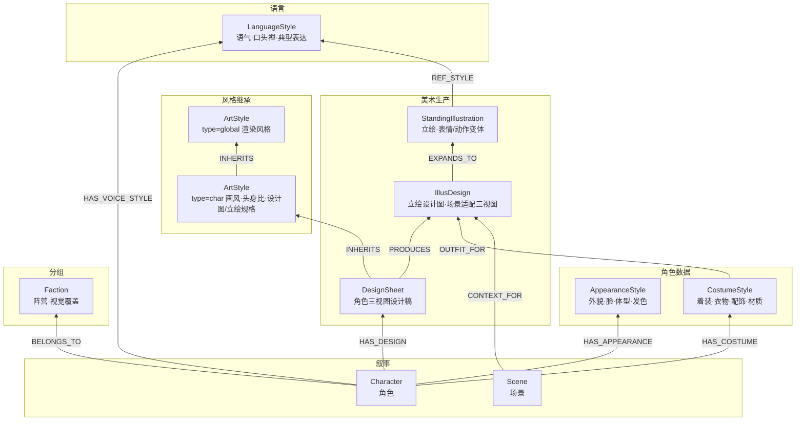
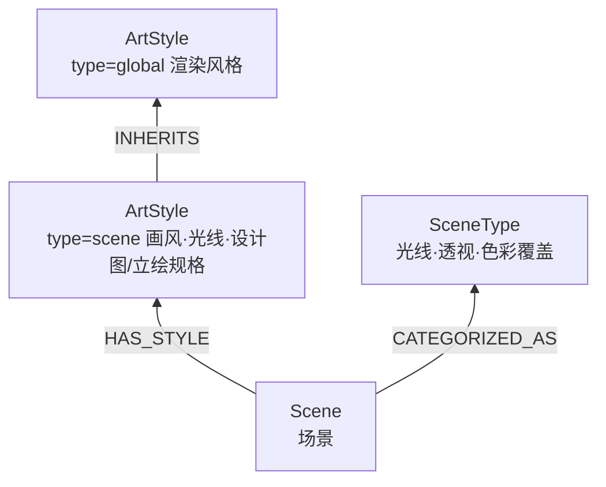
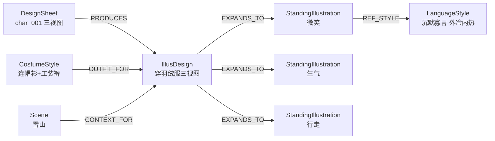

# 他者之镜 Schema

## 目录

**节点类型**
- [角色（Character）](#角色character)
- [事件（Event）](#事件event)
- [场景（Scene）](#场景scene)
- [信息（Info）](#信息info)
- [语言风格（LanguageStyle）](#语言风格languagestyle)
- [美术风格（ArtStyle）](#美术风格artstyle)
- [外貌特征（AppearanceStyle）](#外貌特征appearancestyle)
- [着装特征（CostumeStyle）](#着装特征costumestyle)
- [设计图（DesignSheet）](#设计图designsheet)
- [立绘设计图（IllusDesign）](#立绘设计图illusdesign)
- [立绘（StandingIllustration）](#立绘standingillustration)
- [阵营（Faction）](#阵营faction)
- [场景类型（SceneType）](#场景类型scenetype)

**边类型**
- [relation — 人物关系](#relation--人物关系)
- [involved — 人物参与事件](#involved--人物参与事件)
- [occurred_at — 事件发生地点](#occurred_at--事件发生地点)
- [at — 人物—场景](#at--人物场景)
- [link — 信息关联](#link--信息关联)
- [evt_relation — 事件关联](#evt_relation--事件关联)
- [INHERITS — 风格继承](#inherits--角色风格继承全局风格)
- [HAS_APPEARANCE — 角色拥有外貌特征](#has_appearance--角色拥有外貌特征)
- [HAS_COSTUME — 角色拥有着装特征](#has_costume--角色拥有着装特征)
- [HAS_DESIGN — 角色拥有设计图](#has_design--角色拥有设计图)
- [PRODUCES — 设计图产出立绘设计图](#produces--设计图产出立绘设计图)
- [OUTFIT_FOR — 着装特征提供着装方案](#outfit_for--着装特征提供着装方案)
- [CONTEXT_FOR — 场景提供上下文](#context_for--场景为立绘设计图提供上下文)
- [EXPANDS_TO — 拓展出立绘](#expands_to--立绘设计图拓展出立绘)
- [HAS_VOICE_STYLE — 角色拥有语言风格](#has_voice_style--角色拥有语言风格)
- [REF_STYLE — 立绘参考语言风格](#ref_style--立绘参考语言风格)
- [BELONGS_TO — 角色属于阵营](#belongs_to--角色属于阵营)
- [CATEGORIZED_AS — 场景归类为类型](#categorized_as--场景归类为类型)

**参考**
- [继承结构图（Mermaid）](#继承结构图)
- [ID 规则](#id-规则)
- [边汇总](#边汇总)
- [方向验证规则](#方向验证规则)

---

## 节点类型

### 叙事节点

---

#### 角色（Character）

最小粒度：每个有名字的真实人物。

| 字段 | 中文 | 类型 | 必填 | 示例 |
|------|------|------|------|------|
| id | 编号 | string | 是 | `char_001` |
| name | 姓名 | string | 是 | `陆择` |
| gender | 性别 | enum | 否 | `男` / `女` |
| description | 简介 | string | 否 | `星耀电竞战队队长，沉默寡言的天才选手` |
| birth_year | 出生年份 | int | 否 | `2003` |
| character_tags | 人设标签 | string | 否 | `沉默寡言, 外冷内热, 完美主义` |
| status | 流程状态 | int | 否 | `0` |

**status 枚举**：
- `0`：初始（数据已导入）
- `1`：角色设计完成（美术设定 + 语言风格已生成）
- `2`：美术提示词完成（设计图 + 立绘提示词已生成）
- `3`：图片生成完成（设计图 + 立绘图片已生成）

---

#### 事件（Event）

最小粒度：某时某刻发生的某件事。一个事件 = 一个有明确时间点的具体动作或状态变化。

| 字段 | 中文 | 类型 | 必填 | 示例 |
|------|------|------|------|------|
| id | 编号 | string | 是 | `evt_001` |
| title | 标题 | string | 是 | `陆择从重庆长江大桥跳江` |
| time | 时间 | Date | 是 | `2024-04-11` |
| description | 描述 | string | 否 | `凌晨4时许，陆择独自前往重庆长江大桥跳江身亡` |
| type | 类型 | enum | 否 | `行动` |

**type 枚举**：
- `行动`：具体的物理行为，如跳江、转账、报警
- `交流`：对话、发帖、聊天记录等沟通行为
- `转折`：改变事态走向的关键节点
- `状态变化`：人物状态或关系状态的改变，如分手、确诊

---

#### 场景（Scene）

最小粒度：具体地点/游戏场景。

| 字段 | 中文 | 类型 | 必填 | 示例 |
|------|------|------|------|------|
| id | 编号 | string | 是 | `scene_001` |
| name | 名称 | string | 是 | `重庆长江大桥` |
| description | 描述 | string | 否 | `横跨长江的公路铁路两用桥` |
| status | 流程状态 | int | 否 | `0` |

**status 枚举**：
- `0`：初始（数据已导入）
- `1`：场景设计完成
- `2`：场景美术完成

---

#### 信息（Info）

最小粒度：每条对读者有意义的新认知。一条信息 = 一个之前不知道的事实。

| 字段 | 中文 | 类型 | 必填 | 示例 |
|------|------|------|------|------|
| id | 编号 | string | 是 | `info_001` |
| title | 标题 | string | 是 | `陆择是孤儿` |
| content | 内容 | string | 是 | `陆择从小在孤儿院长大，从未见过亲生父母` |
| knowledge_level | 知识层 | enum | 是 | `2` |

**knowledge_level 枚举**：
- `1`：表层——新闻报道、警方通报等公开信息
- `2`：参与层——需要阅读聊天记录、转账记录等细节才能了解的信息
- `3`：深层——需要综合推断或获取非公开信息才能理解的隐性事实

---

### 语言风格节点

---

#### 语言风格（LanguageStyle）

每个角色一个。定义角色的说话方式、语气、口头禅等。立绘的表情和动作参考语言风格生成。

| 字段 | 中文 | 类型 | 必填 | 说明 |
|------|------|------|------|------|
| id | 编号 | string | 是 | `voice_001` |
| name | 名称 | string | 是 | `陆择语言风格` |
| path | 文件路径 | string | 否 | `05_角色设计/char/char_001/语言风格.md` |
| description | 描述 | string | 否 | 语言风格概要（语气、口头禅、典型表达等） |

---

### 美术风格节点

---

#### 美术风格（ArtStyle）

通过 `type` 区分角色/场景分支。所有风格内容写入 `description`，通过 INHERITS 边形成继承链。

| 字段 | 中文 | 类型 | 必填 | 说明 |
|------|------|------|------|------|
| id | 编号 | string | 是 | `style_001` |
| name | 名称 | string | 是 | |
| type | 类型 | enum | 是 | `global` / `char` / `scene` |
| description | 描述 | string | 否 | 所有风格内容（画风、头身比、渲染风格、设计图/立绘规格等） |

**type 枚举**：
- `global`：全局基础风格（渲染风格等），恰好 1 个
- `char`：角色分支风格（画风、头身比、设计图/立绘规格等），恰好 1 个
- `scene`：场景分支风格（画风、光线、设计图/立绘规格等），恰好 1 个

**继承规则**：子节点非空字段覆盖父节点同名字段，null 字段从父节点继承。`override_fields` 边属性显式记录覆盖了哪些字段。

---

### 角色美术节点

> 外貌数据 + 着装数据 → 设计图（继承 ArtStyle）→ 立绘设计图 → 立绘，构成角色美术的生产链。

---

#### 外貌特征（AppearanceStyle）

每个角色一个。定义角色的固定外貌（脸、体型、发色、瞳色等）。纯数据节点，不参与风格继承。

| 字段 | 中文 | 类型 | 必填 | 说明 |
|------|------|------|------|------|
| id | 编号 | string | 是 | `appearance_001` |
| name | 名称 | string | 是 | `陆择外貌特征` |
| art_design_path | 美术设定路径 | string | 否 | `05_角色设计/char/char_001/美术设定.md` |
| appearance | 外貌描述 | string | 否 | `182cm, 黑色短发, 琥珀色瞳, 偏瘦` |
| color_direction | 主色调 | string | 否 | `深蓝+银灰`（发色、瞳色、肤色相关） |
| shape_language | 形状语言 | string | 否 | 几何形态倾向 |
| visual_tone | 视觉气质 | string | 否 | 氛围/气质描述 |
| first_impression | 第一印象 | string | 否 | |
| memory_points | 记忆点 | string | 否 | |

---

#### 着装特征（CostumeStyle）

每个角色一个。定义角色的默认着装（衣物、配饰、材质等）。纯数据节点，不参与风格继承。立绘设计图会根据场景对默认着装进行适配。

| 字段 | 中文 | 类型 | 必填 | 说明 |
|------|------|------|------|------|
| id | 编号 | string | 是 | `costume_001` |
| name | 名称 | string | 是 | `陆择着装特征` |
| default_outfit | 默认着装 | string | 否 | `黑色连帽衫, 工装裤, 运动鞋` |
| material_direction | 材质方向 | string | 否 | 材质/纹理指引 |
| posture | 体态气质 | string | 否 | 体态/肢体语言 |
| accessories | 配饰 | string | 否 | `银色项链, 左耳钉` |

---

#### 设计图（DesignSheet）

每个角色一个。角色的三视图设计稿。继承 type=char 的 ArtStyle，决定渲染方式、头身比等。

| 字段 | 中文 | 类型 | 必填 | 说明 |
|------|------|------|------|------|
| id | 编号 | string | 是 | `design_001` |
| prompt_path | 提示词路径 | string | 否 | `06_角色美术/char_001/设计图提示词.md` |
| image_path | 图片路径 | string | 否 | `06_角色美术/char_001/设计图.png` |

---

#### 立绘设计图（IllusDesign）

每个 (DesignSheet, Scene) 组合一个。角色在特定场景中的适配三视图设计稿——设计图提供角色基础外观，场景提供环境上下文（如雪山场景中穿羽绒服）。

| 字段 | 中文 | 类型 | 必填 | 说明 |
|------|------|------|------|------|
| id | 编号 | string | 是 | `illus_001` |
| prompt_path | 提示词路径 | string | 否 | `06_角色美术/char_001/立绘设计/scene_003/提示词.md` |
| image_path | 图片路径 | string | 否 | `06_角色美术/char_001/立绘设计/scene_003/设计图.png` |
| adaptation_notes | 适配说明 | string | 否 | `穿着羽绒服、围巾、手套` |

**唯一约束**：通过 `PRODUCES` 和 `CONTEXT_FOR` 边的组合唯一确定，即同一个 DesignSheet 和同一个 Scene 之间最多一个 IllusDesign。

---

#### 立绘（StandingIllustration）

从立绘设计图拓展出的具体变体——不同表情、动作的单张立绘。每张独立节点。表情和动作参考角色的 LanguageStyle 生成。

| 字段 | 中文 | 类型 | 必填 | 说明 |
|------|------|------|------|------|
| id | 编号 | string | 是 | `stand_001` |
| variant_label | 变体标签 | string | 是 | `微笑` / `生气` / `行走` / `待机` |
| prompt_path | 提示词路径 | string | 否 | `06_角色美术/char_001/立绘/scene_003/微笑/提示词.md` |
| image_path | 图片路径 | string | 否 | `06_角色美术/char_001/立绘/scene_003/微笑/立绘.png` |

---

### 分组节点

> 拥有视觉风格属性，作为风格链中的可选中间覆盖层。

---

#### 阵营（Faction）

角色的分组机制。拥有视觉风格属性，在 AppearanceStyle / CostumeStyle 生成时作为 type=char 的 ArtStyle 和角色个人风格之间的可选覆盖层。

| 字段 | 中文 | 类型 | 必填 | 说明 |
|------|------|------|------|------|
| id | 编号 | string | 是 | `faction_001` |
| name | 名称 | string | 是 | `星耀电竞` |
| description | 描述 | string | 否 | 阵营说明 |
| visual_identity | 视觉标识 | string | 否 | 共有视觉元素 |
| color_direction | 色彩方向 | string | 否 | 阵营色调覆盖 |
| material_direction | 材质方向 | string | 否 | 阵营材质覆盖 |

---

#### 场景类型（SceneType）

场景的分组机制。拥有风格属性，在场景最终风格中作为 type=scene 的 ArtStyle 和 Scene 之间的可选覆盖层。

| 字段 | 中文 | 类型 | 必填 | 说明 |
|------|------|------|------|------|
| id | 编号 | string | 是 | `scenetype_001` |
| name | 名称 | string | 是 | `室内住宅` |
| description | 描述 | string | 否 | 类型说明 |
| lighting_direction | 光线方向 | string | 否 | |
| perspective | 透视/机位 | string | 否 | |
| color_direction | 色彩方向 | string | 否 | |

---

## 边类型

### 叙事关系

#### relation — 人物关系

- **方向**：`Character → Character`

| 属性 | 中文 | 类型 | 必填 | 说明 |
|------|------|------|------|------|
| type | 关系类型 | string | 是 | 如"恋爱""亲属""同事""仇人" |
| detail | 详情 | string | 否 | 如"恋爱中""已分手""姐弟" |
| start_time | 开始时间 | Date | 否 | 关系建立的时间 |
| end_time | 结束时间 | Date | 否 | 关系结束的时间（为空表示持续中） |

> 关系可随时间变化：如恋人分手后变为仇人，应建两条 relation 边，分别标记不同的时间区间。

---

#### involved — 人物参与事件

- **方向**：`Character → Event`

| 属性 | 中文 | 类型 | 必填 | 说明 |
|------|------|------|------|------|
| role | 角色 | string | 是 | 如"当事人""目击者""受害者""施害者""参与者" |
| detail | 详情 | string | 否 | |

---

#### occurred_at — 事件发生地点

- **方向**：`Event → Scene`

| 属性 | 中文 | 类型 | 必填 | 说明 |
|------|------|------|------|------|
| detail | 详情 | string | 否 | 如"跳江地点""约会地点" |

---

#### at — 人物—场景

- **方向**：`Character → Scene`

| 属性 | 中文 | 类型 | 必填 | 说明 |
|------|------|------|------|------|
| type | 关联类型 | string | 是 | 如"居住""前往""工作" |
| detail | 详情 | string | 否 | |
| start_time | 开始时间 | Date | 否 | 关联开始的时间 |
| end_time | 结束时间 | Date | 否 | 关联结束的时间（为空表示持续中） |

---

#### link — 信息关联

- **方向**：`任意节点 → Info`
- **特殊规则**：`type=因果` 时仅用于 `Info → Info`，表示原因→结果

| 属性 | 中文 | 类型 | 必填 | 说明 |
|------|------|------|------|------|
| type | 关联类型 | string | 是 | 如"涉及""因果" |
| detail | 详情 | string | 否 | |
| time | 时间 | Date | 否 | 信息关联发生的时间 |

---

#### evt_relation — 事件关联

- **方向**：`Event → Event`

| 属性 | 中文 | 类型 | 必填 | 说明 |
|------|------|------|------|------|
| type | 关联类型 | enum | 是 | `因果` / `先后` / `包含` |
| detail | 详情 | string | 否 | |

**type 方向语义**：`因果` = 前因→后果；`先后` = 时间顺序；`包含` = 大事件→子事件

---

### 风格继承（INHERITS）

#### INHERITS — 角色风格继承全局风格

- **方向**：`ArtStyle[type=char] → ArtStyle[type=global]`

| 属性 | 中文 | 类型 | 必填 | 说明 |
|------|------|------|------|------|
| override_fields | 覆盖字段 | string | 否 | 逗号分隔的被覆盖字段名列表 |

---

#### INHERITS — 场景风格继承全局风格

- **方向**：`ArtStyle[type=scene] → ArtStyle[type=global]`

| 属性 | 中文 | 类型 | 必填 | 说明 |
|------|------|------|------|------|
| override_fields | 覆盖字段 | string | 否 | 逗号分隔的被覆盖字段名列表 |

---

#### INHERITS — 设计图继承角色全局风格

- **方向**：`DesignSheet → ArtStyle[type=char]`

| 属性 | 中文 | 类型 | 必填 | 说明 |
|------|------|------|------|------|
| override_fields | 覆盖字段 | string | 否 | 逗号分隔的被覆盖字段名列表 |

**继承规则**：子节点非空字段覆盖父节点同名字段，null 字段从父节点继承。`override_fields` 显式记录覆盖了哪些字段。

---

### 实体—风格关联（HAS_STYLE）

#### HAS_APPEARANCE — 角色拥有外貌特征

- **方向**：`Character → AppearanceStyle`
- 无属性

---

#### HAS_COSTUME — 角色拥有着装特征

- **方向**：`Character → CostumeStyle`
- 无属性

---

#### HAS_STYLE — 场景引用场景风格

- **方向**：`Scene → ArtStyle[type=scene]`
- 无属性

---

### 美术生产链

#### HAS_DESIGN — 角色拥有设计图

- **方向**：`Character → DesignSheet`
- 无属性

---

#### PRODUCES — 设计图产出立绘设计图

- **方向**：`DesignSheet → IllusDesign`
- 无属性

---

#### CONTEXT_FOR — 场景为立绘设计图提供上下文

- **方向**：`Scene → IllusDesign`
- 无属性

---

#### OUTFIT_FOR — 着装特征提供着装方案

- **方向**：`CostumeStyle → IllusDesign`
- 无属性

> IllusDesign 由三个输入共同决定：DesignSheet（外貌基础）、CostumeStyle（着装方案）、Scene（场景上下文）。

---

#### EXPANDS_TO — 立绘设计图拓展出立绘

- **方向**：`IllusDesign → StandingIllustration`

| 属性 | 中文 | 类型 | 必填 | 说明 |
|------|------|------|------|------|
| variant_label | 变体标签 | string | 是 | 如"微笑""生气""行走""待机" |

---

### 语言风格关联

#### HAS_VOICE_STYLE — 角色拥有语言风格

- **方向**：`Character → LanguageStyle`
- 无属性

---

#### REF_STYLE — 立绘参考语言风格

- **方向**：`StandingIllustration → LanguageStyle`
- **说明**：立绘的表情和动作参考角色语言风格生成
- 无属性

---

### 分组

#### BELONGS_TO — 角色属于阵营

- **方向**：`Character → Faction`
- **注意**：无阵营角色无此边

| 属性 | 中文 | 类型 | 必填 | 说明 |
|------|------|------|------|------|
| role | 角色 | string | 否 | 如"战队经理""战队队长""成员" |

---

#### CATEGORIZED_AS — 场景归类为类型

- **方向**：`Scene → SceneType`
- 无属性

---

## 继承结构图

### 角色美术链

> AppearanceStyle 和 CostumeStyle 是角色数据节点，不参与风格继承。DesignSheet 是唯一的风格继承终端，负责将 ArtStyle 的渲染方式落实到具体角色。

### 场景美术链

> SceneType 的风格属性在场景最终风格中作为中间覆盖层。

### 立绘交叉关系

> IllusDesign 由三个输入共同决定：DesignSheet（外貌基础）、CostumeStyle（默认着装）、Scene（场景上下文，如雪山→羽绒服）。每个 (DesignSheet, Scene) 组合最多一个 IllusDesign。从 IllusDesign 拓展出具体的表情/动作立绘，立绘的表情动作参考语言风格。

---

## ID 规则

| 节点类型 | ID 前缀 | 格式 | 示例 |
|---------|--------|------|------|
| 角色 | `char_` | `char_NNN` | `char_001` |
| 事件 | `evt_` | `evt_NNN` | `evt_001` |
| 场景 | `scene_` | `scene_NNN` | `scene_001` |
| 信息 | `info_` | `info_NNN` | `info_001` |
| 语言风格 | `voice_` | `voice_NNN` | `voice_001` |
| 美术风格 | `style_` | `style_NNN` | `style_001`（global）、`style_002`（char）、`style_003`（scene） |
| 外貌特征 | `appearance_` | `appearance_NNN` | `appearance_001` |
| 着装特征 | `costume_` | `costume_NNN` | `costume_001` |
| 设计图 | `design_` | `design_NNN` | `design_001` |
| 立绘设计图 | `illus_` | `illus_NNN` | `illus_001` |
| 立绘 | `stand_` | `stand_NNN` | `stand_001` |
| 阵营 | `faction_` | `faction_NNN` | `faction_001` |
| 场景类型 | `scenetype_` | `scenetype_NNN` | `scenetype_001` |

---

## 边汇总

| 边 | 从 → 到 | 属性 |
|----|---------|------|
| relation | Character → Character | type, detail, start_time, end_time |
| involved | Character → Event | role, detail |
| occurred_at | Event → Scene | detail |
| at | Character → Scene | type, detail, start_time, end_time |
| link | 任意 → Info | type, detail, time |
| evt_relation | Event → Event | type, detail |
| INHERITS | ArtStyle[type=char] → ArtStyle[type=global] | override_fields |
| INHERITS | ArtStyle[type=scene] → ArtStyle[type=global] | override_fields |
| INHERITS | DesignSheet → ArtStyle[type=char] | override_fields |
| HAS_APPEARANCE | Character → AppearanceStyle | — |
| HAS_COSTUME | Character → CostumeStyle | — |
| HAS_STYLE | Scene → ArtStyle[type=scene] | — |
| HAS_DESIGN | Character → DesignSheet | — |
| PRODUCES | DesignSheet → IllusDesign | — |
| OUTFIT_FOR | CostumeStyle → IllusDesign | — |
| CONTEXT_FOR | Scene → IllusDesign | — |
| EXPANDS_TO | IllusDesign → StandingIllustration | variant_label |
| HAS_VOICE_STYLE | Character → LanguageStyle | — |
| REF_STYLE | StandingIllustration → LanguageStyle | — |
| BELONGS_TO | Character → Faction | role |
| CATEGORIZED_AS | Scene → SceneType | — |

---

## 方向验证规则

创建边前必须验证方向正确：

| from 标签 | 允许的边类型 | to 标签 |
|-----------|------------|---------|
| Character | relation, at, involved, link, HAS_APPEARANCE, HAS_COSTUME, HAS_DESIGN, HAS_VOICE_STYLE, BELONGS_TO | → Character / Scene / Event / Info / AppearanceStyle / CostumeStyle / DesignSheet / LanguageStyle / Faction |
| Event | occurred_at, evt_relation, link | → Scene / Event / Info |
| Scene | link, HAS_STYLE, CATEGORIZED_AS, CONTEXT_FOR | → Info / ArtStyle[type=scene] / SceneType / IllusDesign |
| Info | link | → Info |
| Faction | — | （无出边，作为 Character 的分组目标） |
| SceneType | — | （无出边，作为 Scene 的分组目标） |
| ArtStyle[type=global] | — | （无出边，作为继承根节点） |
| ArtStyle[type=char] | INHERITS | → ArtStyle[type=global] |
| ArtStyle[type=scene] | INHERITS | → ArtStyle[type=global] |
| LanguageStyle | — | （无出边，作为被引用节点） |
| AppearanceStyle | — | （无出边，作为角色外貌数据节点） |
| CostumeStyle | OUTFIT_FOR | → IllusDesign |
| DesignSheet | INHERITS, PRODUCES | → ArtStyle[type=char] / IllusDesign |
| IllusDesign | EXPANDS_TO | → StandingIllustration |
| StandingIllustration | REF_STYLE | → LanguageStyle |
| 任意 | link | → Info |
