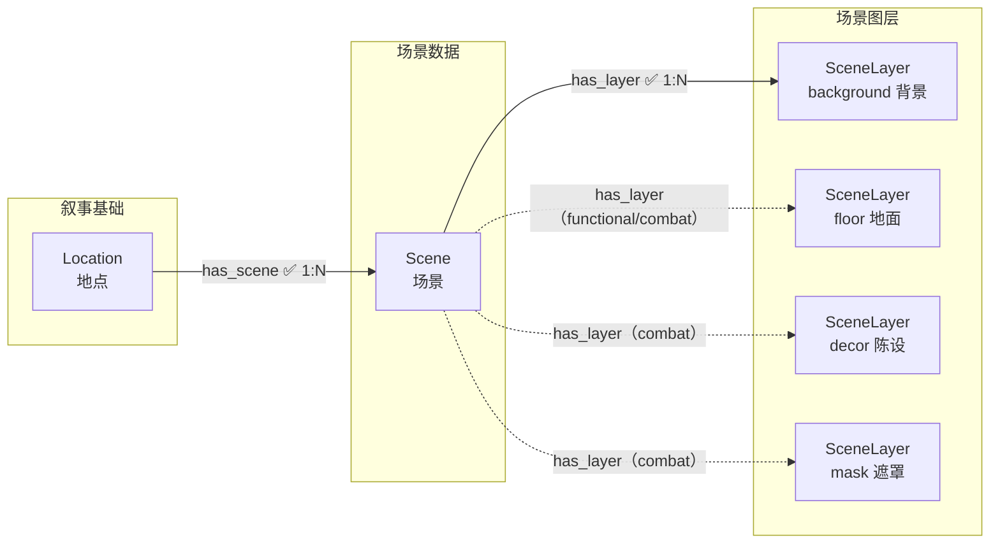

# 03 场景美术

> 场景的渲染与适配——把叙事地点拆解为可生成的场景与图层。

---

> **美术风格**：所有美术风格定义（画风、光线、渲染风格等）统一写入 [00_init/美术风格.md](../../00_init/美术风格.md)，不再存储为图节点。场景风格全局统一，风格词见该文件「提示词硬约束」的风格收尾串。

---

## 节点

> Location 节点定义见 [叙事基础.md](叙事基础.md)。Location 仅保留叙事属性（id/name/description），场景的全部视觉信息下沉到 Scene。

### 场景（Scene）

每个地点一个或多个。定义地点内某个具体子场景（如咖啡店的点餐台、座位区）的视觉设定。纯数据节点，由 `scene-designer` 从 Location 及其事件推导切分，创建后即 `status=1`（已完成，无审批）。

| 字段 | 中文 | 类型 | 必填 | 说明 |
|------|------|------|------|------|
| id | 编号 | string | 是 | snowflake Base62 |
| name | 名称 | string | 是 | `[Location名]-[区域]`，如 `咖啡店-点餐台` |
| scene_type | 场景类型 | enum | 是 | `dialogue`（对话背景）/ `functional`（功能场景）/ `combat`（战斗场景）/ `ui`（UI背景）。决定所需图层（见下表） |
| time_of_day | 时段 | string | 否 | 标签：清晨/白天/黄昏/夜晚 |
| weather | 天气 | string | 否 | 标签：晴/阴/雨/雪/雾 |
| atmosphere | 氛围 | string | 否 | 自由文本：整体氛围一句话 |
| composition | 构图 | string | 否 | 自由文本：远/中/近景分层描述（分号分隔） |
| lighting | 光影 | string | 否 | 自由文本：主光源方向+色温+环境光 |
| color_direction | 配色逻辑 | string | 否 | 自由文本：主辅点缀色与明暗逻辑 |
| description | 概要 | string | 否 | 简短场景描述（1-2 句） |
| status | 流程状态 | int | 否 | `0` |

**status 枚举**：`0` 待设计 → `1` 已完成

---

### 场景图层（SceneLayer）

场景的单一图层（传统 2D 游戏 4 层结构）。用 `layer_type` 区分背景/地面/陈设/遮罩；每个场景按 `scene_type` 按需拥有图层节点。由 `scene-layer-designer` 创建并产出提示词与图片。

| 字段 | 中文 | 类型 | 必填 | 说明 |
|------|------|------|------|------|
| id | 编号 | string | 是 | snowflake Base62 |
| name | 名称 | string | 是 | `[Scene名]-[图层中文]`，如 `咖啡店-点餐台-背景` |
| layer_type | 图层类型 | enum | 是 | `background`（背景）/ `floor`（地面）/ `decor`（陈设）/ `mask`（遮罩） |
| prompt_path | 提示词文件 | string | 否 | 派生 prompt 文件相对路径（`07_场景美术/<Location名>/<Scene名>/<layer_type>/prompt.md`），由 assembler 从 Scene 字段 + 美术风格.md 生成 |
| image_path | 图片路径 | string | 否 | `07_场景美术/<Location名>/<Scene名>/<layer_type>.png` |
| status | 流程状态 | int | 否 | `0` |

**status 枚举**：`0` 待生成 → `1` 提示词文件已生成 → `2` 图片生成完成 → `10` 待审 → `11` 批准

> **图层渲染顺序**（底→顶）：background 背景 → floor 地面 → decor 陈设 →（角色）→ mask 遮罩。遮罩层渲染在角色之上，形成前景遮挡。

---

## 边

### 场景数据关联

#### has_scene — 地点拥有场景 `1:N`

- **方向**：`Location → Scene`

| 属性 | 中文 | 类型 | 必填 | 说明 |
|------|------|------|------|------|
| sync | 同步 | boolean | 否 | 默认 `true`（Location 更新级联重置场景） |

---

#### has_layer — 场景拥有图层 `1:N`

- **方向**：`Scene → SceneLayer`

| 属性 | 中文 | 类型 | 必填 | 说明 |
|------|------|------|------|------|
| sync | 同步 | boolean | 否 | 默认 `true`（场景更新级联重置图层） |

---

### scene_type 与所需图层

图层按需：并非每个场景都需要全部 4 层。`scene_type` 决定该场景要创建哪些 `layer_type` 的 SceneLayer 节点。该映射表同时是 `scene-layer-designer` 创建图层节点的依据。

| scene_type | 中文 | 所需图层（layer_type） | 说明 |
|-----------|------|----------------------|------|
| `dialogue` | 对话背景 | `background` | 对话游戏唯一必需层（当前项目 V1 实现） |
| `functional` | 功能场景 | `background`, `floor` | 功能场景加地面层 |
| `combat` | 战斗场景 | `background`, `floor`, `decor`, `mask` | 完整 4 层 |
| `ui` | UI背景 | `background` | UI 背景 |

---

## 结构图

### 场景美术链



> 实线 = dialogue/ui 场景必需的背景层；虚线 = functional/combat 场景按 scene_type 按需添加。

---

## ID 规则

所有节点使用雪花算法 Base62 编码作为 `id` 属性值（如 `Nv93TkkkgC`），全局唯一，无前缀。由 `.claude/scripts/snowflake_base62.py` 生成。

生成命令：
```bash
python "${CLAUDE_SKILL_DIR}/../../scripts/snowflake_base62.py" -n 1 -q
```

引用已有 Location 时，通过名称从数据库查询：
```cypher
MATCH (l:Location) WHERE l.name='地点名' RETURN l.id AS id
```

---

## 方向验证

| from | 允许的边 | to |
|------|---------|-----|
| Location | has_scene | Scene |
| Scene | has_layer | SceneLayer |
| SceneLayer | — | （终端节点，无出边） |
