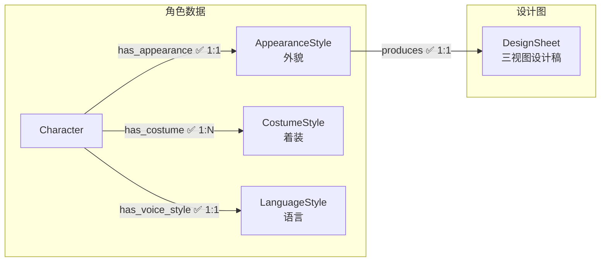
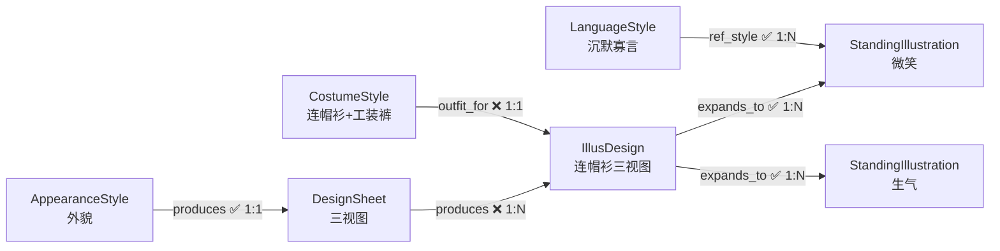

# 02 角色美术

> 角色从文字到画面的完整生产链：外貌/着装数据 → 三视图设计稿 → 立绘设计图 → 立绘变体。

---

> **美术风格**：所有美术风格定义（画风、头身比、渲染风格等）统一写入 [00_init/美术风格.md](../../00_init/美术风格.md)，不再存储为图节点。

---

## 节点

### 语言风格（LanguageStyle）

每个角色一个。定义角色的说话方式、语气、口头禅等。立绘的表情和动作参考语言风格生成。

| 字段 | 中文 | 类型 | 必填 | 说明 |
|------|------|------|------|------|
| id | 编号 | string | 是 | `voice_001` |
| name | 名称 | string | 是 | `[角色名]语言风格` |
| vocabulary | 词汇风格 | string | 否 | 正式/随意、技术性/口语化、阵营术语偏好 |
| rhythm | 句子节奏 | string | 否 | 短促急迫 / 长句思考型 / 混合 |
| habits | 语言习惯 | string | 否 | 口头禅、犹豫模式、特定短语 |
| emotion_patterns | 情绪模式 | string | 否 | 5 种情境（平静/紧张/愤怒/悲伤/轻松）的表达变化 |
| description | 概要 | string | 否 | 简短总结（1-2 句，含身份/绝不会说的话/标准台词等压缩信息） |
| status | 流程状态 | int | 否 | `0` |

**status 枚举**：`0` 待设计 → `1` 已完成

---

### 外貌特征（AppearanceStyle）

每个角色一个。定义角色的固定外貌（脸、体型、发色、瞳色等）。纯数据节点，不参与风格继承。

| 字段 | 中文 | 类型 | 必填 | 说明 |
|------|------|------|------|------|
| id | 编号 | string | 是 | `appearance_001` |
| name | 名称 | string | 是 | `[角色名]外貌特征` |
| appearance | 外貌描述 | string | 否 | `182cm, 黑色短发, 琥珀色瞳, 偏瘦` |
| color_direction | 主色调 | string | 否 | `深蓝+银灰`（发色、瞳色、肤色相关） |
| shape_language | 形状语言 | string | 否 | 几何形态倾向 |
| visual_tone | 视觉气质 | string | 否 | 氛围/气质描述 |
| first_impression | 第一印象 | string | 否 | |
| memory_points | 记忆点 | string | 否 | |
| status | 流程状态 | int | 否 | `0` |

**status 枚举**：`0` 待设计 → `1` 已完成

---

### 着装特征（CostumeStyle）

每套装扮一个节点。定义角色的具体着装（衣物、配饰、材质等）。由 `char-costume-designer` skill 创建，创建后设 `approve='pending'` 等待审批。

| 字段 | 中文 | 类型 | 必填 | 说明 |
|------|------|------|------|------|
| id | 编号 | string | 是 | `costume_001` |
| name | 名称 | string | 是 | `[角色名]着装特征` |
| default_outfit | 默认着装 | string | 否 | `黑色连帽衫, 工装裤, 运动鞋` |
| material_direction | 材质方向 | string | 否 | 材质/纹理指引 |
| posture | 体态气质 | string | 否 | 体态/肢体语言 |
| accessories | 配饰 | string | 否 | `银色项链, 左耳钉` |
| status | 流程状态 | int | 否 | `0` |
| approve | 审批状态 | string | 否 | `null` / `pending` / `approved` / `rejected` |

**status 枚举**：`0` 待设计 → `1` 已完成

**approve 枚举**：
- `null`：初始/未设置
- `pending`：已提交建议，等待审批
- `approved`：已通过，可参与下游 IllusDesign 生产
- `rejected`：已驳回，需重新设计

---

### 设计图（DesignSheet）

每个角色一个。角色的三视图设计稿。渲染方式、头身比等风格参数由 [美术风格.md](../../00_init/美术风格.md) 定义。

| 字段 | 中文 | 类型 | 必填 | 说明 |
|------|------|------|------|------|
| id | 编号 | string | 是 | `design_001` |
| prompt_path | 提示词路径 | string | 否 | `06_角色美术/char_001/设计图提示词.md` |
| image_path | 图片路径 | string | 否 | `06_角色美术/char_001/设计图.png` |
| status | 流程状态 | int | 否 | `0` |

**status 枚举**：`0` 待生成 → `1` 提示词完成 → `2` 图片生成完成

---

### 立绘设计图（IllusDesign）

每个 (DesignSheet, CostumeStyle) 组合一个。角色穿着特定着装的三视图设计稿——由设计图（外貌基础）和着装特征共同决定。

| 字段 | 中文 | 类型 | 必填 | 说明 |
|------|------|------|------|------|
| id | 编号 | string | 是 | `illus_001` |
| image_path | 图片路径 | string | 否 | `06_角色美术/char_001/立绘设计/costume_001/设计图.png` |
| adaptation_notes | 着装补充说明 | string | 否 | `左臂夹持文件夹` |
| status | 流程状态 | int | 否 | `0` |

**status 枚举**：`0` 待生成 → `1` 提示词完成 → `2` 图片生成完成

---

### 立绘（StandingIllustration）

从立绘设计图拓展出的具体变体——不同表情、动作的单张立绘。每张独立节点。表情和动作参考角色的 LanguageStyle 生成。

| 字段 | 中文 | 类型 | 必填 | 说明 |
|------|------|------|------|------|
| id | 编号 | string | 是 | `stand_001` |
| variant_label | 变体标签 | string | 是 | `微笑` / `生气` / `行走` / `待机` |
| image_path | 图片路径 | string | 否 | `06_角色美术/char_001/立绘/costume_001/微笑/立绘.png` |
| status | 流程状态 | int | 否 | `0` |

**status 枚举**：`0` 待生成 → `1` 提示词完成 → `2` 图片生成完成

---

## 边

> 所有边方向：**上游 → 下游**。`sync` 属性控制级联同步。

### 角色数据关联

#### has_appearance — 角色拥有外貌特征 `1:1`

- **方向**：`Character → AppearanceStyle`

| 属性 | 中文 | 类型 | 必填 | 说明 |
|------|------|------|------|------|
| sync | 同步 | boolean | 否 | 默认 `true` |

---

#### has_costume — 角色拥有着装特征 `1:N`

- **方向**：`Character → CostumeStyle`

| 属性 | 中文 | 类型 | 必填 | 说明 |
|------|------|------|------|------|
| sync | 同步 | boolean | 否 | 默认 `true` |

---

#### has_voice_style — 角色拥有语言风格 `1:1`

- **方向**：`Character → LanguageStyle`

| 属性 | 中文 | 类型 | 必填 | 说明 |
|------|------|------|------|------|
| sync | 同步 | boolean | 否 | 默认 `true` |

---

### 美术生产链

#### produces — 外貌产出设计图 `1:1`

- **方向**：`AppearanceStyle → DesignSheet`
- **说明**：设计图由外貌特征产出（角色不再直接指向设计图）

| 属性 | 中文 | 类型 | 必填 | 说明 |
|------|------|------|------|------|
| sync | 同步 | boolean | 否 | 默认 `true` |

---

#### produces — 设计图产出立绘设计图 `1:N`

- **方向**：`DesignSheet → IllusDesign`

| 属性 | 中文 | 类型 | 必填 | 说明 |
|------|------|------|------|------|
| sync | 同步 | boolean | 否 | 默认 `false`（设计图更新不自动级联到立绘设计图） |

---

#### outfit_for — 着装提供方案 `1:1`

- **方向**：`CostumeStyle → IllusDesign`

| 属性 | 中文 | 类型 | 必填 | 说明 |
|------|------|------|------|------|
| sync | 同步 | boolean | 否 | 默认 `false`（着装更新不自动级联到立绘设计图） |

---

#### expands_to — 拓展出立绘 `1:N`

- **方向**：`IllusDesign → StandingIllustration`

| 属性 | 中文 | 类型 | 必填 | 说明 |
|------|------|------|------|------|
| variant_label | 变体标签 | string | 是 | 如"微笑""生气""行走""待机" |
| sync | 同步 | boolean | 否 | 默认 `true` |

---

#### ref_style — 语言风格参考 `1:N`

- **方向**：`LanguageStyle → StandingIllustration`
- **说明**：立绘的表情和动作参考角色语言风格生成

| 属性 | 中文 | 类型 | 必填 | 说明 |
|------|------|------|------|------|
| sync | 同步 | boolean | 否 | 默认 `true` |

---

## 结构图

### 角色美术链

> 角色美术链聚焦数据输入。DesignSheet 及下游的生产链见下方「立绘交叉关系」图。

### 立绘交叉关系

> IllusDesign 由两个上游共同决定：DesignSheet（外貌基础）、CostumeStyle（着装方案）。

---

## ID 规则

| 节点 | 前缀 | 格式 | 示例 |
|------|------|------|------|
| 语言风格 | `voice_` | `voice_NNN` | `voice_001` |
| 外貌特征 | `appearance_` | `appearance_NNN` | `appearance_001` |
| 着装特征 | `costume_` | `costume_NNN` | `costume_001` |
| 设计图 | `design_` | `design_NNN` | `design_001` |
| 立绘设计图 | `illus_` | `illus_NNN` | `illus_001` |
| 立绘 | `stand_` | `stand_NNN` | `stand_001` |

---

## 方向验证

| from | 允许的边 | to |
|------|---------|-----|
| Character | has_appearance, has_costume, has_voice_style | AppearanceStyle / CostumeStyle / LanguageStyle |
| AppearanceStyle | produces | DesignSheet |
| CostumeStyle | outfit_for | IllusDesign |
| DesignSheet | produces | IllusDesign |
| IllusDesign | expands_to | StandingIllustration |
| LanguageStyle | ref_style | StandingIllustration |
| Event | wears | CostumeStyle |
| StandingIllustration | — | （终端节点，无出边） |
