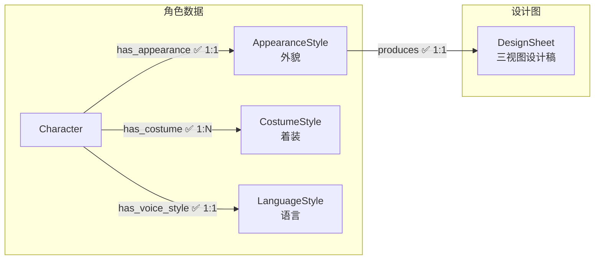
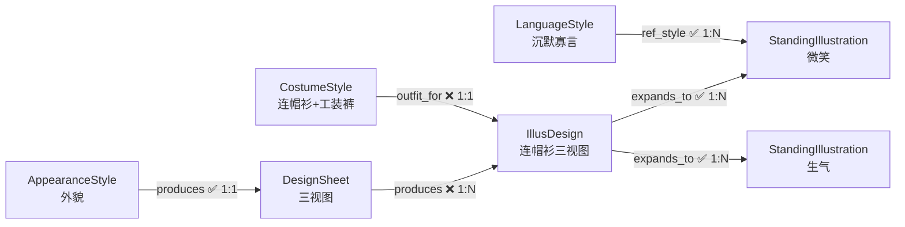

# 02 角色美术

> 角色从文字到画面的完整生产链：外貌/着装数据 → 三视图设计稿 → 立绘设计图 → 立绘变体。

---

> **status 语义**：`-1` 作废重做（sync 级联重置后；skill 必须重新生成并覆盖旧 prompt/image，禁止因文件已存在而跳过）；`0` 首次待生成；`1`/`2` 生产态；`10` 待审；`11` 批准。

> **美术风格**：所有美术风格定义（画风、头身比、渲染风格等）统一写入 [00_init/美术风格.md](../../00_init/美术风格.md)，不再存储为图节点。

> **设计元素标签**：数据节点（AppearanceStyle / CostumeStyle）及立绘（StandingIllustration）的**可枚举设计维度**以**标签**形式存储，字段值为分号 `;` 分隔的标签串。受控词表见 [55_dashboard/config/标签库.json](../../55_dashboard/config/标签库.json)，由管理后台标签选择组件编辑。无法枚举的维度（综合外貌、配色逻辑、具体款式等）仍保留自由文本字段。prompt 不再存节点，由 `char-prompt-assembler` 读 tags + 美术风格.md 派生为文件，节点存 `prompt_path`。

---

## 节点

### 语言风格（LanguageStyle）

每个角色一个。定义角色的说话方式、语气、口头禅等。立绘的表情和动作参考语言风格生成。

| 字段 | 中文 | 类型 | 必填 | 说明 |
|------|------|------|------|------|
| id | 编号 | string | 是 | snowflake Base62 |
| name | 名称 | string | 是 | `[角色名]语言风格` |
| vocabulary | 词汇风格 | string | 否 | 正式/随意、技术性/口语化、阵营术语偏好 |
| rhythm | 句子节奏 | string | 否 | 短促急迫 / 长句思考型 / 混合 |
| habits | 语言习惯 | string | 否 | 口头禅、犹豫模式、特定短语 |
| emotion_patterns | 情绪模式 | string | 否 | 5 种情境（平静/紧张/愤怒/悲伤/轻松）的表达变化 |
| description | 概要 | string | 否 | 简短总结（1-2 句，含身份/绝不会说的话/标准台词等压缩信息） |
| status | 流程状态 | int | 否 | `0` |

**status 枚举**：`0` 待设计 → `1` 已完成

---

### 外貌特征（AppearanceStyle）

每个角色一个。定义角色的固定外貌（脸、体型、发色、瞳色等）。纯数据节点，不参与风格继承。

| 字段 | 中文 | 类型 | 必填 | 说明 |
|------|------|------|------|------|
| id | 编号 | string | 是 | snowflake Base62 |
| name | 名称 | string | 是 | `[角色名]外貌特征` |
| appearance | 外貌描述 | string | 否 | 自由文本：综合气质、身高、整体观感（`约168cm, 曼妙匀称, 慵懒妩媚`） |
| visual_tone | 视觉气质 | string | 否 | 自由文本：氛围/气质一句话 |
| first_impression | 第一印象 | string | 否 | 自由文本 |
| shape_language | 形状语言 | string | 否 | 标签：三角型/方型/倒三角/细长型/圆形/不对称 |
| age_impression | 年龄感 | string | 否 | 标签 |
| body_type | 体态 | string | 否 | 标签 |
| skin_tone | 肤色 | string | 否 | 标签 |
| ethnicity | 面孔/人种 | string | 否 | 标签：中国面孔/日系面孔/韩系面孔/东南亚面孔/欧美面孔/中东面孔/非裔面孔/混血面孔 |
| hair | 头发 | string | 否 | 合成组合（发色+发型+发长）：`深棕色大波浪长发` |
| eye | 眼睛 | string | 否 | 合成组合（瞳色+眼型）：`琥珀色上挑眼` |
| lip_shape | 唇形 | string | 否 | 标签 |
| marks | 特殊标记 | string | 否 | 标签（可多选） |
| status | 流程状态 | int | 否 | `0` |

**status 枚举**：`0` 待设计 → `1` 已完成

---

### 着装特征（CostumeStyle）

每套装扮一个节点。定义角色的具体着装（衣物、配饰、材质等）。由 `char-costume-designer` skill 创建，创建后即 `status=10`（待审）等待审批。

| 字段 | 中文 | 类型 | 必填 | 说明 |
|------|------|------|------|------|
| id | 编号 | string | 是 | snowflake Base62 |
| name | 名称 | string | 是 | `着装名称`：简短描述，例如工作服 |
| outfit_style | 着装风格 | string | 否 | 标签（可多选）：休闲/正式/性感/古风... |
| garment | 服装 | string | 否 | 合成组合（材质+服装类型）：`棉衬衫`（多件分号：`棉衬衫;蕾丝内衣`） |
| footwear | 鞋类 | string | 否 | 标签 |
| accessory_type | 配饰类型 | string | 否 | 标签（可多选） |
| status | 流程状态 | int | 否 | `0` |

**status 枚举**：`0` 待设计 → `1` 已完成 → `10` 待审 → `11` 批准

> 审批态与生产态数值隔开：`10` 待审（已提交等待 dashboard 审批）、`11` 批准（通过，可参与下游 IllusDesign 生产）；驳回后 status 归 `0` 重新设计。

---

### 设计图（DesignSheet）

每个角色一个。角色的三视图提示词与设计稿。

| 字段 | 中文 | 类型 | 必填 | 说明 |
|------|------|------|------|------|
| id | 编号 | string | 是 | snowflake Base62 |
| prompt_path | 提示词文件 | string | 否 | 派生 prompt 文件相对路径（`06_角色美术/<char_name>/prompt.md`），由 assembler 从上游 tags + 美术风格.md 生成 |
| image_path | 图片路径 | string | 否 | `06_角色美术/<char_name>/设计图.png` |
| status | 流程状态 | int | 否 | `0` |

**status 枚举**：`0` 待生成 → `1` 提示词文件已生成 → `2` 图片生成完成 → `10` 待审 → `11` 批准

> prompt 不再存节点字段，仅作为派生产物存文件（`prompt_path`）。

---

### 立绘设计图（IllusDesign）

每个 (DesignSheet, CostumeStyle) 组合一个。角色穿着特定着装的三视图设计稿——由设计图（外貌基础）和着装特征共同决定。

| 字段 | 中文 | 类型 | 必填 | 说明 |
|------|------|------|------|------|
| id | 编号 | string | 是 | snowflake Base62 |
| prompt_path | 提示词文件 | string | 否 | 派生 prompt 文件相对路径 |
| image_path | 图片路径 | string | 否 | `./06_角色美术/<char_name>/<CostumeStyle.name>/立绘设计图.png` |
| adaptation_notes | 着装补充说明 | string | 否 | `左臂夹持文件夹` |
| status | 流程状态 | int | 否 | `0` |

**status 枚举**：`0` 待生成 → `1` 提示词文件已生成 → `2` 图片生成完成 → `10` 待审 → `11` 批准

---

### 立绘（StandingIllustration）

从立绘设计图拓展出的具体变体——不同表情、动作的单张立绘。每张独立节点。表情和动作参考角色的 LanguageStyle 生成。

| 字段 | 中文 | 类型 | 必填 | 说明 |
|------|------|------|------|------|
| id | 编号 | string | 是 | snowflake Base62 |
| prompt_path | 提示词文件 | string | 否 | 派生 prompt 文件相对路径 |
| image_path | 图片路径 | string | 否 | `./06_角色美术/<char_name>/<CostumeStyle.name>/<variant_label>立绘.png` |
| variant_label | 变体 | string | 是 | 标签：默认/微笑/愤怒/悲伤/惊讶/思考/坚定/恐惧/战斗/负伤 |
| eye | 眼部 | string | 否 | 标签 |
| brow | 眉毛 | string | 否 | 标签 |
| mouth | 嘴部 | string | 否 | 标签 |
| head_angle | 头部角度 | string | 否 | 标签 |
| hand | 手部动作 | string | 否 | 标签 |
| foot | 脚部动作 | string | 否 | 标签 |
| status | 流程状态 | int | 否 | `0` |

**status 枚举**：`0` 待生成 → `1` 提示词文件已生成 → `2` 图片生成完成 → `10` 待审 → `11` 批准

---

## 边

> 所有边方向：**上游 → 下游**。`sync` 属性控制级联同步。

### 角色数据关联

#### has_appearance — 角色拥有外貌特征 `1:1`

- **方向**：`Character → AppearanceStyle`

| 属性 | 中文 | 类型 | 必填 | 说明 |
|------|------|------|------|------|
| sync | 同步 | boolean | 否 | 默认 `true` |

---

#### has_costume — 角色拥有着装特征 `1:N`

- **方向**：`Character → CostumeStyle`

| 属性 | 中文 | 类型 | 必填 | 说明 |
|------|------|------|------|------|
| sync | 同步 | boolean | 否 | 默认 `true` |

---

#### has_voice_style — 角色拥有语言风格 `1:1`

- **方向**：`Character → LanguageStyle`

| 属性 | 中文 | 类型 | 必填 | 说明 |
|------|------|------|------|------|
| sync | 同步 | boolean | 否 | 默认 `true` |

---

### 美术生产链

#### produces — 外貌产出设计图 `1:1`

- **方向**：`AppearanceStyle → DesignSheet`
- **说明**：设计图由外貌特征产出（角色不再直接指向设计图）

| 属性 | 中文 | 类型 | 必填 | 说明 |
|------|------|------|------|------|
| sync | 同步 | boolean | 否 | 默认 `true` |

---

#### produces — 设计图产出立绘设计图 `1:N`

- **方向**：`DesignSheet → IllusDesign`

| 属性 | 中文 | 类型 | 必填 | 说明 |
|------|------|------|------|------|
| sync | 同步 | boolean | 否 | 默认 `true`（设计图更新级联重置立绘设计图） |

---

#### outfit_for — 着装提供方案 `1:1`

- **方向**：`CostumeStyle → IllusDesign`

| 属性 | 中文 | 类型 | 必填 | 说明 |
|------|------|------|------|------|
| sync | 同步 | boolean | 否 | 默认 `true`（着装更新级联重置立绘设计图） |

---

#### expands_to — 拓展出立绘 `1:N`

- **方向**：`IllusDesign → StandingIllustration`

| 属性 | 中文 | 类型 | 必填 | 说明 |
|------|------|------|------|------|
| variant_label | 变体标签 | string | 是 | 如"微笑""生气""行走""待机" |
| sync | 同步 | boolean | 否 | 默认 `true` |

---

#### ref_style — 语言风格参考 `1:N`

- **方向**：`LanguageStyle → StandingIllustration`
- **说明**：立绘的表情和动作参考角色语言风格生成

| 属性 | 中文 | 类型 | 必填 | 说明 |
|------|------|------|------|------|
| sync | 同步 | boolean | 否 | 默认 `true` |

---

## 结构图

### 角色美术链



> 角色美术链聚焦数据输入。DesignSheet 及下游的生产链见下方「立绘交叉关系」图。

### 立绘交叉关系



> IllusDesign 由两个上游共同决定：DesignSheet（外貌基础）、CostumeStyle（着装方案）。

---

## ID 规则

所有节点使用雪花算法 Base62 编码作为 `id` 属性值（如 `Nv93TkkkgC`），全局唯一，无前缀。由 `.claude/scripts/snowflake_base62.py` 生成。

生成命令：
```bash
python "${CLAUDE_SKILL_DIR}/../../scripts/snowflake_base62.py" -n 1 -q
```

---

## 方向验证

| from | 允许的边 | to |
|------|---------|-----|
| Character | has_appearance, has_costume, has_voice_style | AppearanceStyle / CostumeStyle / LanguageStyle |
| AppearanceStyle | produces | DesignSheet |
| CostumeStyle | outfit_for | IllusDesign |
| DesignSheet | produces | IllusDesign |
| IllusDesign | expands_to | StandingIllustration |
| LanguageStyle | ref_style | StandingIllustration |
| Event | wears | CostumeStyle |
| StandingIllustration | — | （终端节点，无出边） |
