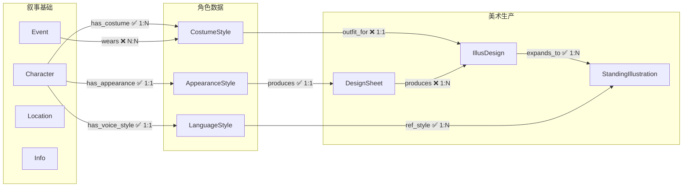

# 他者之镜 Schema 总览

> Schema 按模块拆分，渐进式披露。每个文件自包含节点定义、边定义、ID 规则。

---

## 全局规则

**边方向原则**：所有边方向统一为 **上游（被继承者/源头）→ 下游（继承者/消费者）**。

**同步机制**：每条边都有 `sync` 属性（boolean）。当上游节点更新时，所有 `sync=true` 的出边指向的下游节点自动标记为"待修改"。同步沿边方向级联传播。

---

## 模块索引

| 文件 | 内容 | 核心节点 |
|------|------|---------|
| [叙事基础.md](Schema/叙事基础.md) | 角色是谁、做了什么、在哪里、知道什么 | Character, Event, Location, Info |
| [角色美术.md](Schema/角色美术.md) | 角色如何从文字变成画面 | AppearanceStyle, CostumeStyle, LanguageStyle, DesignSheet, IllusDesign, StandingIllustration |
| [剧情.md](Schema/剧情.md) | 剧情节奏、分支、条件 | 待补充 |

---

## 全节点速查

> 所有节点 ID 使用雪花算法 Base62 编码（如 `Nv93TkkkgC`），全局唯一，无前缀。由 `.claude/scripts/snowflake_base62.py` 生成。
> 引用已有叙事基础节点时，通过名称从数据库查询 ID，不依赖前缀推断。

| 节点 | ID 格式 | 一句话说明 |
|------|---------|-----------|
| Character | snowflake Base62 | 有名字的人物 |
| Event | snowflake Base62 | 某时某刻发生的某件事 |
| Location | snowflake Base62 | 具体地点/游戏场景 |
| Info | snowflake Base62 | 一条有意义的认知碎片 |
| LanguageStyle | snowflake Base62 | 角色说话方式、语气、口头禅 |

| AppearanceStyle | snowflake Base62 | 角色固定外貌（脸、体型、发色） |
| CostumeStyle | snowflake Base62 | 角色默认着装（衣物、配饰） |
| DesignSheet | snowflake Base62 | 角色三视图设计稿 |
| IllusDesign | snowflake Base62 | 着装适配立绘设计图 |
| StandingIllustration | snowflake Base62 | 具体表情/动作的单张立绘 |

---

## 全局边速查

| 边 | 从 → 到 | 基数 | sync | 说明 |
|----|---------|------|------|------|
| **叙事基础** | | | | |
| relation | Character → Character | N:N | ❌ | 人物关系 |
| involved | Character → Event | N:N | ❌ | 人物参与事件 |
| occurred_at | Event → Location | N:1 | ❌ | 事件发生地点 |
| at | Character → Location | N:N | ❌ | 人物—场景 |
| link | Character/Event/Location → Info | N:N | ❌ | 信息关联（仅 3 大实体） |
| evt_relation | Event → Event | N:N | ❌ | 事件因果/时序 |
| **角色美术** | | | | |

| has_appearance | Character → AppearanceStyle | 1:1 | ✅ | 角色外貌 |
| has_costume | Character → CostumeStyle | 1:N | ✅ | 角色着装 |
| has_voice_style | Character → LanguageStyle | 1:1 | ✅ | 角色语言风格 |
| produces | AppearanceStyle → DesignSheet | 1:1 | ✅ | 外貌产出设计图 |
| produces | DesignSheet → IllusDesign | 1:N | ❌ | 设计图→立绘设计图 |
| outfit_for | CostumeStyle → IllusDesign | 1:1 | ❌ | 着装→立绘设计图 |
| wears | Event → CostumeStyle | N:N | ❌ | 事件着装 |
| expands_to | IllusDesign → StandingIllustration | 1:N | ✅ | 拓展表情/动作变体 |
| ref_style | LanguageStyle → StandingIllustration | 1:N | ✅ | 语言风格→立绘参考 |

---

## 全局结构图

