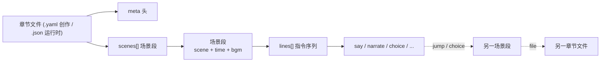

# 05 剧本

> galgame 剧本格式——把「逐句对话 + 立绘 + 场景 + 分支」固化成结构化数据。**创作区（`25_剧本/`）用 YAML（人读），运行时（`99_game/`）用 JSON（Godot 直接消费，由 `chapter-publisher` 转换）**。
> **纯 skill 生成**；本文件只定义格式，不涉及生成流程。

---

## 定位

- **剧本独立**：剧本是逐句对话的第一公民，自包含分支；与 [Schema总览.md](../Schema总览.md) 的图数据（Character/Event/Choice/立绘）**不双向导航**。图退为设计/分析用途（规划分支结构、给生成 skill 参考），运行时不消费图。
- **创作区 YAML / 运行时 JSON**：创作区 `.yaml` 人读友好（缩进、`#` 注释）；`chapter-publisher` 发布时转成 `.json`，Godot 原生 `JSON.parse` 直接读，零运行时构建步骤。
- **唯一衔接**：剧本只写**逻辑名**（角色/立绘/场景/曲目），经一张 **manifest** 映射到实际资源路径；manifest 可由现有美术生产链产物自动生成。剧本与资源解耦。

---

## 数据模型

层级：**章节文件 → 场景段 → 指令序列**。指令序列扁平，分支靠 `label` + 跳转。



---

## 文件组织

- **一个章节 = 创作区每节一个 `.yaml` 文件 + 运行时一个合并后的 `.json` 文件**。创作按节进行：`chapter-dialoguer` 为每节产出 `chapter<NN>_<章概述>/sec<MM>_<节概述>/完整对话.yaml`（节级定稿，挂 `Section.script_path`）；`chapter-publisher` 在全章各节定稿就绪后，把它们**拍平合并**成单一 `99_game/data/chapters/chapter<NN>_<章概述>.json`（章级运行时文件，同名主体即章节标识）。章节划分建议对齐 [大纲.md](../大纲.md) 的叙事段落。
- 章节内含该章**完整对话**。
- 跨章节跳转用 `file`（不带扩展名）指向目标章节文件名。
- **章节与图的关系**：每个运行时章节 JSON 对应图中的 `Chapter` 节点；章下挂若干 `Section` 节点（`has_section` 边），每节锚定自己的 `outline_path` / `script_path`（创作区节级 `outline.md` 提纲 / `完整对话.yaml` 定稿）。编排信息（标题/序号/分节/场景顺序/分支骨架）入图作设计层，逐句对话不入图——运行时只读本 JSON，图仅供生成与分析（见 [Schema/剧情.md](Schema/剧情.md)）。
- **创作区与运行时区分离**：剧情侧四 skill（`chapter-structurer` 章级 → `chapter-outliner` → `chapter-dialoguer` 节级 → `chapter-publisher` 章级发布）产出的提纲与定稿剧本先落 **`25_剧本/`**（创作/审阅区，`Section.outline_path` / `script_path` 指向节级文件，dashboard 在此逐节预览/审批）；各节定稿审通过（`Section.status=31`）且所需立绘就绪后，由 `chapter-publisher` 把全章各节剧本**合并拍平** + 涉及的立绘/背景资源打包发布到 **`99_game/data/chapters/`** + `99_game/assets/`（Godot 运行时消费区）。两区解耦：改 `25_剧本/` 不影响已发布版本。

---

## 创作区 YAML 与运行时 JSON 的边界

| 区域 | 路径 | 格式 | 谁产出 | 进 schema 校验？ |
|------|------|------|--------|------------------|
| 创作区提纲（节级） | `25_剧本/chapter<NN>_<章概述>/sec<MM>_<节概述>/outline.md` | Markdown | `chapter-outliner` | 否（含 `authoring` 人读字段） |
| 创作区定稿（节级） | `25_剧本/chapter<NN>_<章概述>/sec<MM>_<节概述>/完整对话.yaml` | YAML | `chapter-dialoguer` | 是（schema 子集 1:1） |
| 运行时定稿（章级合并） | `99_game/data/chapters/chapter<NN>_<章概述>.json` | JSON | `chapter-publisher`（合并转换） | 是（转换后复校） |

- **创作区定稿 YAML**：人读友好（缩进、`#` 注释），schema 子集 1:1。
- **创作区提纲 Markdown**（`outline.md`）：纯人读人改——拓扑骨架用 `key: value` 行 + 反引号标契约值，`authoring` 散文为 md 正文自由换行。不进 schema、不受 YAML 规则约束（详见「提纲格式」节）。
- **运行时 JSON**：Godot `JSON.parse` 直接消费；由 `chapter-publisher` 用 [merge_sections_to_chapter.py](../99_game/tools/merge_sections_to_chapter.py) 把全章各节定稿 YAML 按节序合并拍平（`scenes[]` 纯拼接，`meta.requires` 取并集），再用 [validate_chapter.py](../99_game/tools/validate_chapter.py) 复校。
- **节级定稿 YAML ↔ 章级运行时 JSON 字段完全一致**（`scenes[]` 结构相同），仅语法不同；章 JSON 的 `meta` 取章节点值 + 各节 `requires` 并集。跨章节 `file` 引用用章 stem（不带后缀）。

### YAML 写作安全规则（仅约束定稿 `完整对话.yaml`）

> `outline.md` 是纯 Markdown，**不适用**以下规则——提纲不进 schema、不被任何代码转换，authoring 散文自由换行即可。以下规则仅约束会被转换进运行时 JSON 的定稿 YAML。

1. **所有 string 值强制双引号**——根治 YAML 1.1 bool 陷阱（裸 `yes` / `no` / `on` / `off` 会被解析成 bool）和半角冒号断裂。
2. **多行文本用双引号 + `\n`**，禁用块标量 `|` / `>`（否则转换后换行数漂移）。
3. **bool 用小写 `true` / `false`**。
4. **字段顺序对齐 schema properties 顺序**（稳定 diff）。
5. **定稿 YAML 严格 schema 子集**，不加任何额外字段（schema `additionalProperties: false`，多一个字段校验 FAIL）。

---

## 提纲格式（outline.md）

`chapter-outliner` 产出**节级**提纲，落盘 `25_剧本/chapter<NN>_<章概述>/sec<MM>_<节概述>/outline.md`（**纯 Markdown，人读人改**）。提纲 = **拓扑骨架（`key: value` 行 + 反引号标契约值）+ `authoring` 人读散文**，同处一个 md 文件。

> **为什么是 md 而非 yaml**：提纲是纯人读 + LLM 读的中间产物——不被任何 Python 解析、不进 schema 校验、唯一消费者是 `chapter-dialoguer`（LLM）。YAML 的双引号 / 禁块标量 / 缩进约束，对人改作者意图（direction / beats 等长散文）是纯负担。Markdown 让拓扑骨架保持可机读契约的同时，authoring 散文自由换行、零语法约束。

### 拓扑骨架（chapter-dialoguer 必须原样搬到定稿）

用 md 的 `- key: value` 行表达；**反引号标注的值是契约值，搬进定稿 YAML 时必须原样、不得改写**：

- **资源清单**：`- 出场角色：`角色名``、`- 场景：`场景名``（提纲段**不列立绘变体**，细节对话段才补）。
- **每个场景段**：二级标题 `## 场景段：`id`` 下挂 `- 场景：`场景名`` / `- 时段：清晨` / `- BGM：`track`（mode, loop）`。
- **分支拓扑**（对应定稿 `lines` 占位）：仅在存在 `choice` / `jump` / `ending` 时用 md 列表写出，如 `- choice：选项「label」→ scene `id`（leads_to_ending）`、`- jump → file `chapter01_新皮肤``。无分支的段此节留空（dialoguer 填逐句对话）。

### authoring 人读散文（不进定稿，仅供 dialoguer 参考；不进 schema）

| md 章节 | 旧字段名 | 位置 | 含义 |
|------|------|------|------|
| `## 方向` | `direction` | 节级 | 一段话讲清**本节**剧情发展方向（核心字段） |
| `## 情感弧` | `emotion_arc` | 节级 | 情感弧线起点 → 终点 + 中途转折 |
| `## 约束` | `constraints` | 节级 | 给 dialoguer 的硬约束清单 |
| `### 职责` | `purpose` | 每场景段 | 这场戏的戏剧职责 |
| `### 节拍` | `beats` | 每场景段 | 节拍走向（自然语言列表，**禁写台词**）—— 解决事件粒度粗，给 dialoguer 节拍依据 |
| `### 母题锚点` | `motif_anchors` | 每场景段 | 母题 / 象征物锚点 |
| `### 衔接` | `transition` | 每场景段 | 场景衔接方式说明 |

提纲确定「本节分几段、每段场景/时间/bgm、choice 分叉与汇合、ending 位置」的骨架；`chapter-dialoguer` 读提纲文件，以「节拍（beats）」章节为节拍依据，在**保持拓扑契约值不变**的前提下填充逐句 `say` / `narrate` / `show` 等 lines，产出完整定稿 `完整对话.yaml`。**authoring 散文不搬进定稿**。

> 提纲本身**不是** `剧本.schema.json` 的校验对象（它是定稿的中间产物，含 authoring 人读字段）；只有 `chapter-dialoguer` 产出的定稿必须通过 schema 校验。

---

## 章节文件结构

```json
{
  "meta": { ... },
  "scenes": [ {场景段}, {场景段}, ... ]
}
```

### meta

| 字段 | 中文 | 类型 | 必填 | 说明 |
|------|------|------|------|------|
| chapter | 章节 | int / string | 是 | 章节编号或标识 |
| title | 标题 | string | 是 | 章节标题 |
| requires | 资源清单 | object | 否 | 本章节用到的逻辑名，供运行时预加载 + manifest 校验 |

`requires` 子字段：

| 字段 | 说明 |
|------|------|
| characters | 角色逻辑名数组，如 `["陈默"]` |
| scenes | 场景逻辑名数组，如 `["长江大桥-栏杆"]` |
| portraits | 立绘逻辑名数组，`<角色>.<变体>`，如 `["陈默.沉重"]` |

---

## 场景段（scene block）

章节内的一段连续对话，绑定其背景与音乐。

| 字段 | 中文 | 类型 | 必填 | 说明 |
|------|------|------|------|------|
| id | 段标识 | string | 是 | **全章节内唯一**（跨节不重复），供跳转定位；由 `chapter-structurer` 在分节规划时预分配 |
| scene | 场景 | string | 是 | 背景场景逻辑名（→ manifest → 场景图） |
| time | 时段 | string | 否 | 氛围标注：清晨 / 白天 / 黄昏 / 夜晚 |
| bgm | 音乐 | object | 否 | 该段背景音乐（进入即播放） |
| lines | 指令序列 | array | 是 | 该段对话指令（见「指令集」） |

`bgm` 结构同 `bgm` 指令：`{ track, mode, loop? }`。

> 进入场景段：自动套用其 `scene`（背景）+ `bgm`。段内仍可用 `bg` / `bgm` 指令临时切换（边缘用法）。

---

## 指令集

每条指令是 `lines` 数组里的一个对象，用 `op` 区分类型。分四类：

- **阻塞**：播完暂停，等玩家输入（点击 / 选择）再推进。
- **即时**：执行后立即进下一条，用于铺垫。
- **标记 / 流程**：`label` 锚点、`jump` 跳转。
- **终止**：`ending`。

| op | 作用 | 类型 |
|----|------|------|
| `say` | 角色说话（必带立绘） | 阻塞 |
| `narrate` | 旁白 / 环境叙述 | 阻塞 |
| `show` | 显示 / 换立绘（无对话时） | 即时 |
| `hide` | 隐藏立绘 | 即时 |
| `bg` | 切背景 | 即时 |
| `bgm` | 背景音乐控制 | 即时 |
| `sfx` | 一次性音效 | 即时 |
| `choice` | 选择点 | 阻塞 |
| `label` | 跳转锚点 | 标记 |
| `jump` | 跳转 | 流程 |
| `ending` | 进结局 | 终止 |

### say

| 字段 | 中文 | 类型 | 必填 | 说明 |
|------|------|------|------|------|
| who | 角色 | string | 是 | 角色逻辑名 |
| portrait | 立绘 | string | 是 | 立绘变体键；与 who 组合为 `<who>.<portrait>` |
| pos | 站位 | enum | 是 | `left` / `center` / `right` |
| text | 台词 | string | 是 | 对话文本 |
| voice | 语音 | string | 否 | 语音键（→ manifest.voices）；`voice-publisher` 后处理注入，**创作区 YAML 不写** |
| emotion | 情绪 | string | 否 | 情绪标签（`平静`/`高兴`/`悲伤`/`愤怒`/`震惊`/`无奈`/`调侃`/`温柔`/`冷漠`/`紧张`/`恐惧`/`坚定`，可扩）；`chapter-dialoguer` 据台词当下情绪标注，供 `voice-publisher` → CosyVoice instruct 映射（见 [15_声音/emotion_instruct.json](../15_声音/emotion_instruct.json)） |

> **`emotion` 情绪字段**（可选）：CosyVoice 后端 clone 时，按此标签映射到 `instruct`（`用XX语气说`），控制同一角色音色下的话语情绪。**创作区定稿 YAML 必须标**（chapter-dialoguer 写），不像 `voice` 是后处理——emotion 是创作意图，配音据此演绎。词表见 [15_声音/emotion_instruct.json](../15_声音/emotion_instruct.json)，未覆盖的标签走默认「自然的语气」。

> **每条 `say` 必带立绘**：渲染该条时，将该角色立绘按 `pos` 放置。运行时按 `pos` **累积维持**各位置立绘——A 放 `left` 后，B 的 `say` 放 `right`，A 仍在 `left`，直到被同位置新 `say` 覆盖或 `hide` 移除。独白布局用 `center`。

> **`voice` 语音字段**（可选）：运行时 `Game._on_line_ready` 拿 voice 键 → `manifest.voices` → 音频路径 → `AudioManager.play_voice` 同步播音；推进时 `play_voice` 首行 `stop()` 自覆盖停旧播新（覆盖点击 / Auto / Skip / Ctrl 全路径），`narrate` 触发 `play_voice("")` 仅停不播。**创作区定稿 YAML 不写 `voice`**——由 `voice-publisher` 在章级 JSON 合并后按 `<char>-<stem>-<scene_id>-<line_idx>` **后处理注入**（三处对齐：wav/ogg 文件名 = `manifest.voices` 键 = `say.voice`，单一来源 `voice_bundler.make_voice_key`，机制同立绘 guid 整键搬运）。基线音色由图 `VoiceProfile` 节点治理（见 [Schema/声音.md](Schema/声音.md)）。

### narrate

| 字段 | 中文 | 类型 | 必填 | 说明 |
|------|------|------|------|------|
| text | 文本 | string | 是 | 旁白 / 环境叙述 |

> `narrate` 不携带立绘，**维持当前画面**。

### show / hide

`show`（即时，无对话时展示 / 换立绘）：`who`(是) · `portrait`(是) · `pos`(否，缺省 `center`)。
`hide`（即时，移除立绘）：`who`(是)。

> 主流程靠 `say` 自带立绘；`show` / `hide` 仅用于角色不说话时的入场 / 离场。

### bg / bgm / sfx

`bg`（即时，切背景）：`scene`(是) · `time`(否) · `transition`(否，`fade` / `cut`，缺省 `cut`)。
`bgm`（即时）：`track`(是) · `mode`(是，`play` / `stop` / `fade`) · `loop`(否，缺省 `true`)。
`sfx`（即时，一次性音效）：`track`(是)。

### choice

| 字段 | 中文 | 类型 | 必填 | 说明 |
|------|------|------|------|------|
| options | 选项 | array | 是 | 每项见下 |

`options[]` 每项：

| 字段 | 中文 | 类型 | 必填 | 说明 |
|------|------|------|------|------|
| label | 选项文本 | string | 是 | 玩家可见 |
| to | 段内 label | string | 否 | 跳当前段内锚点 |
| scene | 场景段 id | string | 否 | 跳本章节内该段 |
| file | 章节 | string | 否 | 跨章节文件名 |
| leads_to_ending | 导向结局 | boolean | 否 | 标记该选项进入结局 |

> 每个选项须含 `to` / `scene` / `file` 至少其一（V1 不支持无跳转的 flavor 选项）。玩家选择后据此跳转（见「跳转寻址」）。

### label / jump

`label`（标记）：`name`(是，所在场景段内唯一)。
`jump`（流程）：`to`(否) · `scene`(否) · `file`(否)；至少含其一。

### ending

| 字段 | 中文 | 类型 | 必填 | 说明 |
|------|------|------|------|------|
| kind | 结局类型 | enum | 是 | `BE` / `TE` / `HE` / `NE` |
| title | 标题 | string | 否 | |
| cg | 结局 CG | string | 否 | CG 逻辑名（→ manifest） |

---

## 跳转寻址

`to` / `scene` / `file` 三者组合，层层可选：

| 组合 | 含义 |
|------|------|
| `to` | 当前场景段内 label |
| `scene` | 本章节内该 id 的场景段（从头） |
| `scene` + `to` | 本章节该段的 label |
| `file` | 跨章节文件（从头） |
| `file` + `scene`(+`to`) | 跨章节到指定段（的 label） |

> `choice` 选项与 `jump` 共用此寻址。

---

## 资源引用与 manifest

剧本只写逻辑名，不经 manifest 不知资源路径。manifest 把逻辑名映射到实际文件：

```json
{
  "portraits": {
    "陈默.沉重": "07_角色美术/陈默/沉重.png",
    "陈默.释然": "07_角色美术/陈默/释然.png"
  },
  "scenes": {
    "长江大桥-栏杆": "07_场景美术/长江大桥/栏杆/background.png",
    "出租屋":        "07_场景美术/出租屋/background.png"
  },
  "bgm": { "夜风": "audio/bgm/night_wind.ogg" },
  "sfx": {},
  "voices": { "陈默-chapter01_新皮肤-桥上-0": "assets/voices/陈默-chapter01_新皮肤-桥上-0.ogg" },
  "cg":  {}
}
```

- **立绘逻辑名** `<角色>.<变体>` ↔ [StandingIllustration](角色美术.md) 的表情 / 动作变体；资源路径取其 `image_path`。
- **场景逻辑名** ↔ [Scene](场景美术.md) 的 `name`；V1 对话场景仅用 background 层，故映射到单张背景图。多图层场景（functional / combat）留待扩展。
- manifest 可由美术生产链产物自动生成；换图 / 改路径不动剧本。

> **立绘 guid 整键（搬运层去冲突）**：创作区 YAML 的 `portrait` 永远写纯变体（`慵懒`）。当同角色换装导致两套立绘同名时（如序章陆择 sec00「赤裸上身」/ sec01「商务休闲着装」都有「慵懒」），`chapter-publisher` 搬运时用 [generate_portrait_map.py](../99_game/tools/generate_portrait_map.py) 把 `say/show.portrait` 改写为 guid 整键 `<char>-<costume>-<variant>-<stand_id>`（`stand_id` = 图 `StandingIllustration.id`，全局唯一），manifest 键、PNG 文件名同源对齐（[portrait_key.make_key](../99_game/tools/portrait_key.py)）。运行时 [PortraitLayer](../99_game/scripts/ui/PortraitLayer.gd) 直接用 portrait 字段整键查 manifest；旧章二维键走「拼 who」fallback。创作区 YAML 与 `variant_label` 不感知此机制。

> **运维约束**：给已有角色新增一套着装会改变 manifest 键（全图重跑 `manifest_builder.py`），但旧章 JSON 仍引用搬运时的键——已发布章不受影响（键一经搬运即固化在 JSON 里）；仅当旧章需要纳入新着装时才重搬该章。

---

## 运行时消费（简述）

Godot 侧：**只读 `chapter-publisher` 转换后的 `.json`**（创作区 `.yaml` 不进 Godot）→ `JSON.parse` → JSON Schema 校验 → 解释器维护指令指针逐条执行——阻塞指令等输入、即时指令即进、`jump` 移指针、`ending` 终止。场景段切换时套用其 `scene` + `bgm`；立绘按 `say` 的 `who + portrait + pos` 渲染并累积维持。

> 具体实现不在本格式 spec 范围。

---

## JSON Schema

权威校验定义见 [剧本.schema.json](剧本.schema.json)。**skill 生成剧本后必须通过该校验才交付**——它是格式的验收门。

---

## 完整示例

`chapter01_新皮肤.json`（运行时 JSON 形态节选，含场景段切换、分支、结局）。创作区 YAML 定稿结构与之 1:1，仅语法差异；提纲（outline.md）是纯 Markdown，额外含 `authoring` 散文：

```json
{
  "meta": {
    "chapter": 1,
    "title": "新皮肤·Day0",
    "requires": {
      "characters": ["陈默"],
      "scenes": ["长江大桥-栏杆", "出租屋"],
      "portraits": ["陈默.沉重", "陈默.释然", "陈默.疲惫"]
    }
  },
  "scenes": [
    {
      "id": "桥上",
      "scene": "长江大桥-栏杆",
      "time": "夜晚",
      "bgm": { "track": "夜风", "mode": "play", "loop": true },
      "lines": [
        { "op": "say", "who": "陈默", "portrait": "沉重", "pos": "center", "text": "就到这里吧。" },
        { "op": "narrate", "text": "江风很大。他翻过栏杆。" },
        { "op": "choice", "options": [
            { "label": "再想想", "to": "keepgoing" },
            { "label": "跳下去", "scene": "结局_BE", "leads_to_ending": true }
          ]
        },
        { "op": "label", "name": "keepgoing" },
        { "op": "say", "who": "陈默", "portrait": "释然", "pos": "center", "text": "……电话响了。" },
        { "op": "jump", "scene": "回出租屋" }
      ]
    },
    {
      "id": "回出租屋",
      "scene": "出租屋",
      "time": "凌晨",
      "lines": [
        { "op": "narrate", "text": "步行回八楼，身体像被掏空。" },
        { "op": "say", "who": "陈默", "portrait": "疲惫", "pos": "center", "text": "……回来了。" }
      ]
    },
    {
      "id": "结局_BE",
      "scene": "长江大桥-栏杆",
      "time": "夜晚",
      "lines": [
        { "op": "narrate", "text": "第二天，很多人自发买了吃的来祭奠。" },
        { "op": "ending", "kind": "BE", "title": "无人知晓的纵身" }
      ]
    }
  ]
}
```

---

## V1 边界

**含**：章节 → 场景段 → 指令序列结构；11 条指令；`say` 必带立绘；`meta.requires`；manifest 资源映射；JSON Schema 校验。

**不含（YAGNI）**：变量 / flag、条件分支（`if`）；特效（wait / shake / flash）；独立 CG 指令（结局 `cg` 字段除外）；存档指令（运行时在选择点 / 场景段头自动存档）；多图层场景；时段驱动的背景变体；skill 生成流程。

> 所有分支由 `choice` 直接跳转表达，运行时无状态。未来若需好感度 / flag 驱动分支，再扩 `set` / `if` 指令。

---

## 命名规则

- 创作区目录结构（按章/节分层）：

  ```
  25_剧本/chapter00_序章/         # 章 = chapter<NN>_<章概述>
  ├── 设计简报.md                  # 章级（structurer 产）
  ├── sec00_酒店醒来/              # 节 = sec<MM>_<节概述>
  │   ├── outline.md             # 节级提纲（outliner 产）
  │   └── 完整对话.yaml            # 节级定稿（dialoguer 产）
  ├── sec01_意外突生/
  │   ├── outline.md
  │   └── 完整对话.yaml
  └── sec02_灵魂夹缝/
      ├── outline.md
      └── 完整对话.yaml
  ```

  `<NN>`=`chapter_no`、`<MM>`=`section_no` 零填充；<章概述>/<节概述> 取 title 核心主题，清洗 Windows 非法字符。运行时章文件仍为 `99_game/data/chapters/chapter<NN>_<章概述>.json`（章 stem，publisher 合并各节拍平，运行时不感知节层）。
- 场景段 `id`：**全章节内唯一**（跨节不重复），由 `chapter-structurer` 预分配（建议 `s<MM>_<short>`，如 `s01_桥上`）。
- `label.name`：所在场景段内唯一。
- 逻辑名：角色用姓名；立绘 `<角色>.<变体>`；场景对齐 `Scene.name`。
