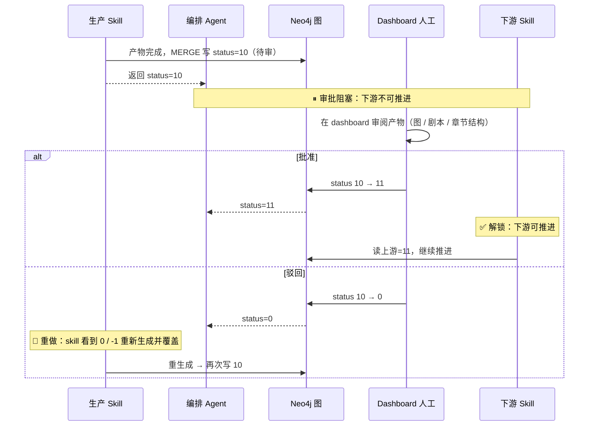
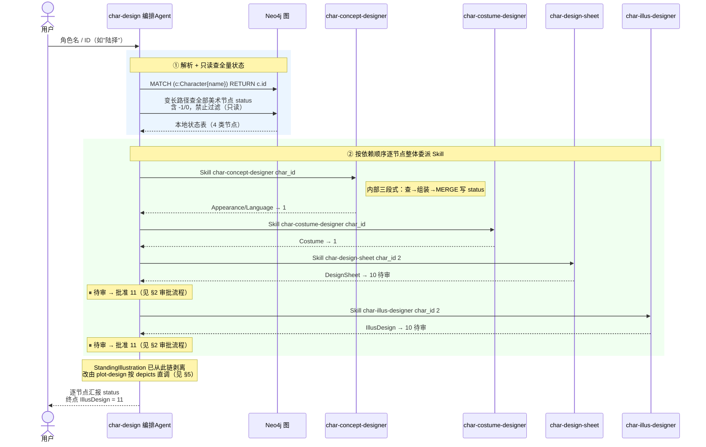
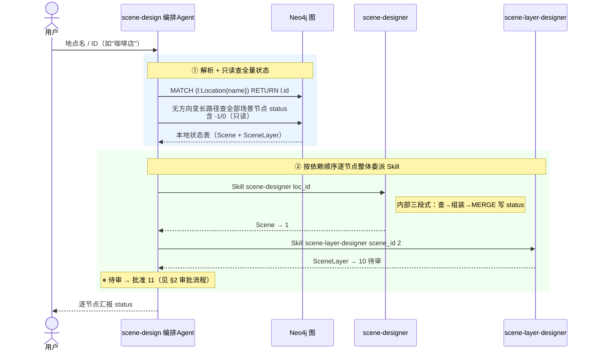
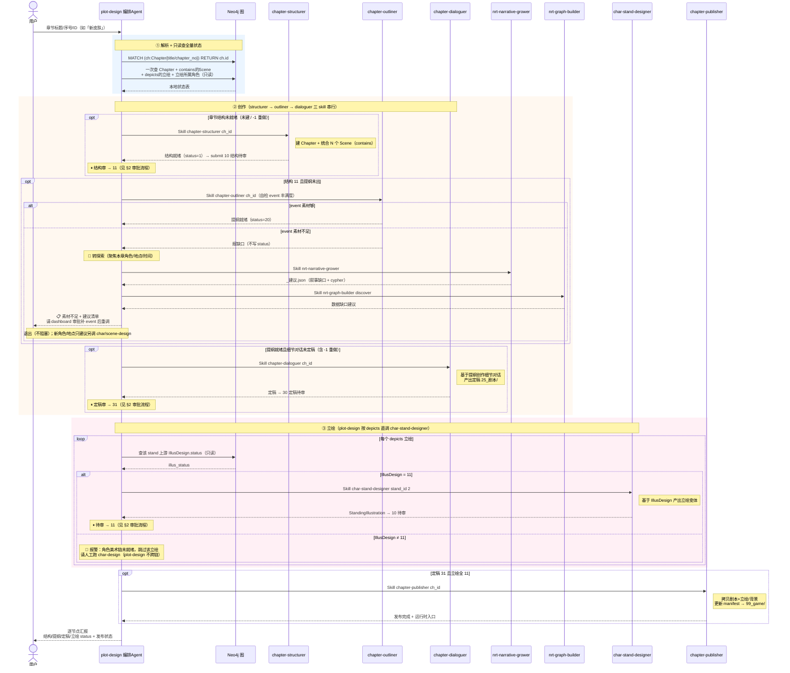

# 他者之镜 - 三大编排 Agent 流程图

> **本文定位**：可视化 [.claude/agents/](.claude/agents/) 下三个编排层 Agent（`char-design` / `scene-design` / `plot-design`）的执行流程，统一用**时序图**表达。
>
> - **审批流程独立成节**（[§2](#2-审批流程)），不在各 Agent 时序图里展开——时序图只画"生产调度"主线，遇到待审就用 `⏸ 待审 → 批准 11` 一行带过并引用 §2。
> - **两处架构改动（已落地）**：
>   1. plot-design 创作侧拆为 `chapter-structurer` → `chapter-outliner` → `chapter-dialoguer` 三步（已替代原一次性 `screenwriter`，后者已删除）。
>   2. **StandingIllustration 的调用从 `char-design` 剥离，改由 `plot-design` 直接调度**——`char-design` 终点收窄到 `IllusDesign`；`char-stand-designer` 新增 stand_id 入参模式支持按需出图。
>
> 互补文档：[refer.md](refer.md)（节点治理手册：status / sync 级联 / 审批规则）。子项目指南：[55_dashboard/CLAUDE.md](55_dashboard/CLAUDE.md)（后台）、[99_game/README.md](99_game/README.md)（Godot 工程）。

---

## 目录

1. [三个 Agent 的共同铁律](#三个-agent-的共同铁律)
2. [审批流程](#2-审批流程)
3. [char-design —— 角色美术生产链](#char-design--角色美术生产链)
4. [scene-design —— 场景美术生产链](#scene-design--场景美术生产链)
5. [plot-design —— 剧情创作生产链](#plot-design--剧情创作生产链)
6. [全部 Skill 功能概述](#全部-skill-功能概述)

---

## 三个 Agent 的共同铁律

> `char-design` / `scene-design` / `plot-design` 是三条生产链各自的**纯编排层**，骨架完全一致，差异只在"调度哪几个 skill / agent"。

| 铁律 | 含义 |
|------|------|
| **纯分发，不亲自动手** | 只做：解析输入 → 只读查 status → 据 status 决策 → 用 `Skill`/`Agent` 工具整体委派 → 复查 → 汇报。**严禁**亲自写 Cypher、亲自调生成脚本、拆解生产 skill 的内部步骤、直接调纯产出子 skill（`*-prompt-assembler` / `infra-image-generator`）。 |
| **只读查全量，禁止过滤 -1** | 开局一次查询拿到本地状态表。`-1`（作废重做）与 `0`（待生成）都是待办，**禁止**在 WHERE 加 `status >= 0` 把 `-1` 滤掉。 |
| **调度只看 status，不看产物文件** | 唯一判据是节点 `status` 与 `target_status`。**禁止**因 `prompt_path`/`image_path`/`script_path` 已有值或磁盘文件已存在而跳过；`-1` 必须重生成并**覆盖**旧产物，重做时禁止读旧文件。 |
| **全量循环推进，禁止只推一个就停** | 枚举所有 `status < 10` 的待办逐个委派，直到全部到达终态、撞上审批阻塞（`10` 待 dashboard 批）、或撞上需用户决策的分歧点，才返回。 |
| **审批阻塞** | 生产节点产物完成即提交 `10`（待审）；`11`（批准）才允许下游推进；驳回归 `0`。审批由 [55_dashboard](55_dashboard/) 人工触发，**详见 [§2 审批流程](#2-审批流程)**。 |
| **复查就地在内存表更新** | 仅在 skill/agent 返回（发生一次写入）后，对**该被推进节点**复查一次；禁止每推一个就重查整张子图。 |
| **汇报逐节点交代** | 列出全部节点，逐个给 `status` + 本轮是否处理；未推进的说明原因；**禁止**把 `status=-1` 误报成"节点未创建"。 |

### status 语义（三链通用）

```
-1  作废重做（sync 级联重置后；看到 -1 必须重生成覆盖，禁止跳过）
 0  待处理 / 待生成
 1  已完成（数据节点）｜提示词完成（生产节点）
 2  图片完成（生产节点可选中间态）
10  待审（审批专属，等 dashboard）
11  批准（生产节点唯一"真正完成"值）
```

> 审批态与生产态数值隔开：生产用 `0/1/2`，审批专属 `10`/`11`。数据节点完成值 `1`（无审批）；生产节点完成值 `11`。

---

## 2. 审批流程

> 所有**生产节点**（产出图片/剧本/章节结构的节点）完成后都要人工审批。审批态用 `10`（待审）/ `11`（批准），与生产态 `0/1/2` 隔开。本节是通用流程，各 Agent 时序图遇到待审均引用此处。



### 待审节点清单

| 节点 | 进入待审 | 批准（11）解锁的下游 |
|------|---------|---------------------|
| DesignSheet | 图片完成 → 10 | IllusDesign |
| IllusDesign | 图片完成 → 10 | StandingIllustration（plot-design 按 depicts 推进） |
| StandingIllustration | 图片完成 → 10 | 无下游；作为发布前置（质量确认） |
| SceneLayer | 图片完成 → 10 | 无下游；作为发布前置 |
| Chapter（章节结构） | 结构就绪 → 10 | 创作（提纲 / 细节对话），批准→11 |
| Chapter（定稿） | 定稿完成 → 30 | 立绘 + 发布，批准→31 |

> AppearanceStyle / LanguageStyle / CostumeStyle / Scene 等数据节点完成值 `1`，**无审批**。

---

## char-design —— 角色美术生产链

> **唯一职责**：推进某角色的美术链。输入**角色名或 ID**（如"陆择"、snowflake ID）。
> 依赖顺序：`char-concept-designer → char-costume-designer → char-design-sheet → char-illus-designer`。
> `StandingIllustration` 已从此链**剥离**（迁至 plot-design 按 depicts 引用按需出图），`char-design` 终点收窄到 `IllusDesign`。

### 节点 → Skill 映射

| 图节点 | Skill | Status 流程 | 审批 |
|--------|-------|------------|------|
| AppearanceStyle / LanguageStyle | char-concept-designer | -1/0 → 1 | 无 |
| CostumeStyle | char-costume-designer | -1/0 → 1 | 无 |
| DesignSheet | char-design-sheet | -1/0→1→2→10→11 | ✅ |
| IllusDesign | char-illus-designer | -1/0→1→2→10→11 | ✅ |
| ~~StandingIllustration~~ | ~~char-stand-designer~~ | 已剥离给 plot-design（见 §5） | — |

### 时序图



---

## scene-design —— 场景美术生产链

> **唯一职责**：推进某地点的场景美术。输入**地点名或 ID**（如"咖啡店"、snowflake ID）。
> 依赖顺序：`scene-designer → scene-layer-designer`（Location→Scene→SceneLayer，最深 2 跳）。

### 节点 → Skill 映射

| 图节点 | Skill | Status 流程 | 审批 |
|--------|-------|------------|------|
| Scene | scene-designer | -1/0 → 1 | 无 |
| SceneLayer | scene-layer-designer | -1/0→1→2→10→11 | ✅ |

### 时序图



---

## plot-design —— 剧情创作生产链

> **唯一职责**：推进某章节从「建结构 → 创作（提纲 + 细节对话）→ 立绘 → 发布」全链到运行时。输入**章节标题、序号或 ID**（如「新皮肤」、`1`、snowflake ID）。
>
> 创作链 = **结构段 → 结构审 → 提纲段 → 定稿段 → 定稿审 → 立绘（按需）→ 发布**：
> 1. 创作侧拆为 `chapter-structurer`（建结构）→ `chapter-outliner`（提纲）→ `chapter-dialoguer`（定稿），原 `screenwriter` 已删除。
> 2. 立绘侧：**StandingIllustration 由 plot-design 直接调 `char-stand-designer <stand_id>`**（按需）；上游 `IllusDesign` 未就绪时**报警跳过**（不跨链调 `char-design`，角色美术链由人工单独跑）。
> 3. 探索门控：**outliner 自检 event 不够丰满时拒绝产出提纲**，plot-design 转 `nrt-narrative-grower` + `nrt-graph-builder`（聚焦本章）补叙事基础，产建议后退出——用户 dashboard 审批写回补 event 再重调（不自动衔接 char/scene 生产，只建议）。

### 创作侧三阶段（对应 3 个 skill）

| 阶段 | Skill | 状态 | 职责 |
|------|-------|------|------|
| ① 建章节 | `chapter-structurer` | ✅ 已实现 | 在图中建 Chapter 节点，把 N 个 Scene 统合进来（contains 边） |
| ② 出提纲 | `chapter-outliner` | ✅ 已实现 | 为章节产出提纲（`25_剧本/*.outline.json`） |
| ③ 细节对话 | `chapter-dialoguer` | ✅ 已实现 | 基于提纲创作细节对话，产出定稿剧本到 `25_剧本/` |

> **门控**：① 建章节结构 → 结构审通过 → 才进入 ②③ 创作；细节对话定稿终审通过 + 立绘全 `11` → 才发布。
> **Chapter status 三段**：结构 `0→1→10→11` / 提纲 `→20` / 定稿 `→30→31`（两道审批：结构审 + 定稿审）。

### 节点 → Skill 映射

| 图节点 | 委派对象 | 工具 | Status 流程（示意） | 审批 |
|--------|---------|------|-------------------|------|
| Chapter（章节结构） | `chapter-structurer` | Skill | -1/0→1→10→11 | ✅ 结构审 |
| Chapter（提纲） | `chapter-outliner` | Skill | →20 | — |
| Chapter（细节对话） | `chapter-dialoguer` | Skill | →30→31 | ✅ 定稿审 |
| StandingIllustration | `char-stand-designer` | **Skill（plot-design 直调 stand_id）** | -1/0→1→2→10→11 | ✅ |
| Chapter 发布 | `chapter-publisher` | Skill | 仅 Chapter=31 且 立绘全 11 后 | — |

### 时序图



---

## 全部 Skill 功能概述

> 下表覆盖三条生产链的全部 skill + 叙事层 + 基础设施。**纯产出层**（只产文件、不读写图、不写 status）单独标注。三个**编排 Agent**（`char-design` / `scene-design` / `plot-design`）不在此表——它们是调度者，调度的对象就是表里的 skill。

### 叙事层（创作输入 → 叙事图）

| Skill | 功能 | 主要产出 | 读写图 / 写 status |
|-------|------|---------|-------------------|
| nrt-narrative-extractor | 从创作文本提取结构化实体 + 6 种关系 | CSV + import.cypher（离线文件） | ❌ 不直连（人工触发导入） |
| nrt-graph-builder | 手动 / discover 发现模式增量建图 | 直接写入 Neo4j | ✅ |
| nrt-narrative-grower | analyze → generate → apply 叙事自增长 | `02_剧情数据/` 草案 MD（frontmatter status） | ✅（apply 写回） |

### 角色美术层（Character → IllusDesign）

| Skill | 阶段 | 功能 | 主要产出 | 读写图 / 写 status |
|-------|------|------|---------|-------------------|
| char-concept-designer | ① 概念 | 外貌 + 语言风格设计 | AppearanceStyle / LanguageStyle 字段 | ✅ |
| char-costume-designer | ② 着装 | 着装设计 | CostumeStyle 字段 | ✅ |
| char-design-sheet | ③ 三视图 | 外貌底图设计（文生图） | DesignSheet prompt + 图 | ✅ |
| char-illus-designer | ④ 立绘设计图 | 着装适配立绘（图生图） | IllusDesign prompt + 图 | ✅ |
| char-stand-designer | ⑤ 立绘变体 | 表情/动作变体（图生图）；支持 stand_id 按需模式 | StandingIllustration prompt + 图 | ✅（plot-design 直调） |
| char-prompt-assembler | 纯产出 | 组装角色提示词（Mode A/B/C） | prompt 文件 | ❌ |

### 场景美术层（Location → SceneLayer）

| Skill | 阶段 | 功能 | 主要产出 | 读写图 / 写 status |
|-------|------|------|---------|-------------------|
| scene-designer | ① 场景 | 场景设计 | Scene 字段 | ✅ |
| scene-layer-designer | ② 图层 | 场景图层（文生图/图生图） | SceneLayer prompt + 图 | ✅ |
| scene-prompt-assembler | 纯产出 | 组装场景提示词 | prompt 文件 | ❌ |

### 剧情层（Chapter → 运行时）

| Skill | 阶段 | 功能 | 主要产出 | 读写图 / 写 status |
|-------|------|------|---------|-------------------|
| chapter-structurer | ① 建章节 | 建 Chapter + 统合 N 个 Scene | Chapter + contains 边 | ✅ |
| chapter-outliner | ② 提纲 | 为章节出提纲 | `25_剧本/*.outline.json` | ✅ |
| chapter-dialoguer | ③ 细节对话 | 基于提纲创作细节对话 + 建 depicts 立绘缺口 | 定稿剧本 `25_剧本/` | ✅ |
| chapter-publisher | 发布 | 发布剧本 + 立绘/背景到运行时 | `99_game/` 资源 + manifest | ✅ |

### 基础设施 & 元工具

| 组件 | 功能 | 说明 |
|------|------|------|
| infra-image-generator | 读 prompt 调 OfoxAI API 出图（纯产出） | 文生图 / 图生图；不写图、不写 status |
| cypher_exec.py | 执行 Cypher（统一图读写入口） | 所有 skill 读写 Neo4j 的唯一脚本，支持 `-c`/`-f`/`--stdin`/`--multi`/`--json` |

> 纯产出层（`char-prompt-assembler` / `scene-prompt-assembler` / `infra-image-generator`）只产文件，节点字段与 status 一律由调用方生产 skill 在「保存结果」步用 MERGE 兜底写入。

---

## 项目文件夹结构

> 目录前缀的数字是**流水线阶段编号**（创作输入 `00_` → 叙事数据 `01_` → 剧情数据 `02_` → 美术 `06_/07_` → 剧本 `25_` → 后台 `55_` → 成品 `99_`），按编号即可判断某产物在链路中的位置。`.claude/` 是 Claude Code 自动化层（skill / agent / 脚本）。

```
他者之镜/
├── .claude/                          # Claude Code 自动化层
│   ├── agents/                       # 编排 agent：char-design / scene-design / plot-design
│   ├── scripts/                      # cypher_exec.py · snowflake_base62.py（图读写 + ID 生成）
│   └── skills/                       # 全部生产 skill（见 §6 全部 Skill 功能概述）
│
├── 00_init/                          # 创作输入 + Schema（唯一事实来源）
│   ├── Schema/                       # Neo4j Schema（叙事基础 / 角色美术 / 场景美术 / 剧情）
│   └── migration/
│
├── 01_叙事数据/                      # nrt-narrative-extractor 离线产出
│   └── csv/                          # 实体/关系 CSV + import.cypher
│
├── 02_剧情数据/                      # nrt-narrative-grower 叙事草案（frontmatter status 驱动审批）
│
├── 06_角色美术/                      # 角色美术产出（DesignSheet / IllusDesign / StandingIllustration）
│   ├── 沈暮雪/
│   │   ├── 沈暮雪-电竞经理职业装/    # 每套着装 = 一个 IllusDesign，含 prompt.md + 立绘设计图.png
│   │   └── …                         # 同角色其余着装（咖啡店休闲装 / 西餐厅约会装 / 路边摊日常 …）
│   ├── 陆择/
│   └── …                             # 其余角色（林梦 / 苏晓禾 / 陈默 / 顾盈 …）
│
├── 07_场景美术/                      # 场景美术产出（Scene / SceneLayer）
│   └── 酒店/
│       └── 酒店-客房/
│           └── background/           # 各图层背景图
│
├── 25_剧本/                          # 剧本产出（chapter-structurer/outliner/dialoguer → outline + 定稿 JSON）
│
├── 55_dashboard/                     # 人工治理后台（Streamlit，http://localhost:8501）
│   ├── config/                       # settings.py（凭证来源）
│   ├── core/                         # schema_loader · status · cascade · graph_repo
│   ├── repo/                         # 后台层 Cypher 读写封装（cypher_exec.py 的等价物）
│   ├── tests/                        # core 层单测（纯单测，不连真实 Neo4j）
│   └── ui/                           # 页面 + components/
│
└── 99_game/                          # Godot 4.3+ 游戏运行时（chapter-publisher 发布目标）
    ├── assets/                       # portraits / scenes / bgm
    ├── data/chapters/                # 发布后的章节剧本 JSON（ScriptInterpreter 消费）
    ├── scenes/                       # Godot 场景
    ├── scripts/                      # autoload / data / scenes / ui / util
    ├── tools/                        # validate_chapter.py（数据校验，无需 Godot）
    └── tests/
```
