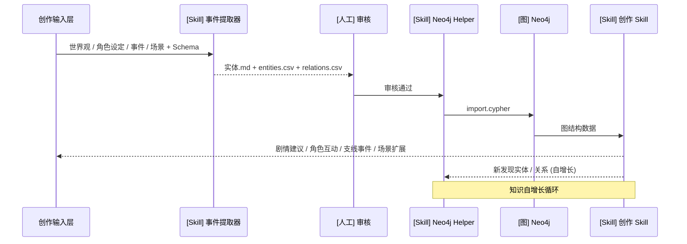
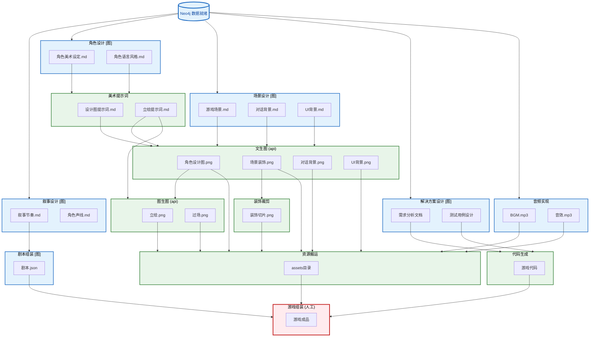
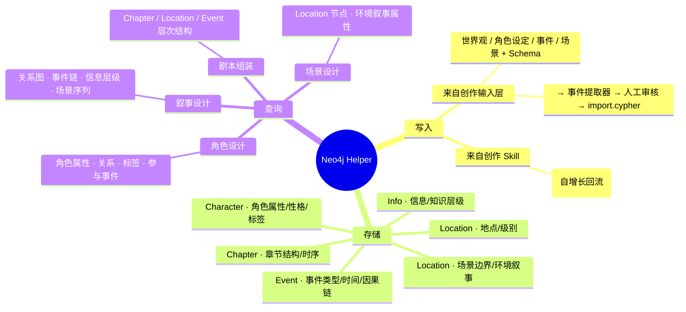

# 他者之镜 - 游戏开发流程图

---

## 1. 叙事数据打磨流程 (剧本 → 图数据库)

> 反复迭代：撰写剧本 → 提取结构化数据 → 导入图数据库 → 审查 → 补充/修改 → 再次提取。




## 2. 游戏开发流程 (图数据已就绪)

---

> 前提：Neo4j 中已有完整的叙事数据（角色、事件、场景、章节等），开发流程从此开始。



### Neo4j 数据中枢 (mindmap)

> 下方独立展示 Neo4j 作为结构化数据中枢的角色：哪些 Skill 向图写入，哪些从图读取。



---

## 图例说明

| 样式 | 含义 |
|------|------|
| 蓝色节点 + [图] 标记 | 从 Neo4j 读取结构化数据的 Skill |
| 绿色节点 | Skill 自动完成 |
| 红色节点 | 人工完成 |
| 虚线箭头 | 迭代回溯（审查后返回修改） |

---


## Skill 说明

### 叙事数据打磨阶段 (图1)

| Skill | 说明 |
|-------|------|
| **事件提取器** | 从创作输入提取实体/关系，输出实体.md + entities.csv + relations.csv |
| **人工审核** | 审核提取结果，通过或驳回修改 |
| **Neo4j Helper** | 汇总所有读写操作，去重/合并/补全后生成 Cypher，写入图数据库 |
| **创作 Skill** | 基于图数据推理，生成剧情建议/角色互动/支线事件/场景扩展，自增长回流新实体和关系 |

### 游戏开发阶段 (图2)

| Skill | 说明 |
|-------|------|
| **叙事设计** | 查询关系图/事件链/信息层级/场景序列 → 叙事节奏.md、角色声线.md |
| **角色设计** | 查询角色属性/关系/标签/参与事件 → 角色美术设定.md、角色语言风格.md |
| **场景设计** | 查询 Location 节点环境叙事属性 → 游戏场景.md、对话背景.md、UI背景.md |
| **剧本组装** | 查询 Chapter/Location/Event 层次结构 → 剧本.json |
| **解决方案设计** | 基于代码需求进行技术方案分析 → 需求分析文档、测试用例设计 |
| **美术提示词** | 根据角色美术设定 → 设计图提示词.md、立绘提示词.md |
| **文生图 (api)** | 调用 seedream API → 角色设计图/场景装饰/对话背景/UI背景 .png |
| **图生图 (api)** | 调用 seedream API → 立绘.png、过场.png |
| **装饰裁剪** | 切割宫格图片 → 装饰切片.png |
| **音频实现** | 根据音频需求 → BGM.mp3、音效.mp3 |
| **代码生成** | 根据需求分析文档 → 游戏代码 |
| **资源搬运** | 将终稿资源同步到 assets 目录 |
| **游戏组装** | 将剧本、代码、资源组装为游戏成品 |

---

## 项目文件夹结构

```
他者之镜/
├── 00_init/                          # 创作输入层 (图1)
│   ├── 游戏概览.md
│   ├── 世界设定.md
│   ├── 剧本大纲.md
│   ├── 人物设定.md
│   └── Schema.md                     # Neo4j Schema 规则
│
├── 01_叙事数据/                      # 事件提取器产出 (图1)
│   ├── 实体/
│   │   ├── 角色实体.md
│   │   ├── 事件实体.md
│   │   └── 地点实体.md
│   ├── entities.csv
│   └── relations.csv
│
├── 05_角色设计/                      # 角色设计 [图] (图2)
│   ├── 角色设计总览.md
│   └── char/
│       └── char_001/
│           ├── 美术设定.md
│           └── 语言风格.md
│
├── 06_角色美术/                      # 美术提示词 + 文生图 + 图生图
│   ├── 角色美术总览.md
│   └── char_001/
│       ├── 设计图提示词.md
│       ├── 设计图.png
│       └── 立绘/
│           ├── 立绘提示词.md
│           └── *.png
│
├── 10_场景设计/                      # 场景设计 [图] (图2)
│   ├── 场景设计总览.md
│   ├── 游戏场景/
│   │   └── scene_xxx_场景名/
│   │       ├── 概览.md
│   │       └── room_xxx_房间名/
│   │           └── 提示词.md
│   ├── 对话背景/
│   │   └── dialog_xxx_场景名/
│   │       └── 提词.md
│   └── UI背景/
│       └── ui_xxx_界面名/
│           └── 提示词.md
│
├── 11_场景美术/                      # 文生图产出 + 装饰裁剪
│   ├── 场景美术总览.md
│   ├── 游戏场景/
│   │   └── scene_xxx_场景名/
│   │       └── room_xxx_房间名/
│   │           ├── 场景装饰.png
│   │           └── 装饰切片/
│   │               └── *.png
│   ├── 对话背景/
│   │   └── *.png
│   └── UI背景/
│       └── *.png
│
├── 15_叙事设计/                      # 叙事设计 [图] (图2)
│   ├── 叙事节奏.md
│   └── 角色声线.md
│
├── 20_剧本/                          # 剧本组装 [图] (图2)
│   ├── 剧本总览.md
│   ├── 剧本.json
│   └── 章节/
│       └── 第一章.md
│
├── 25_解决方案设计/                  # 解决方案设计 [图] (图2)
│   ├── 需求分析文档.md
│   └── 测试用例设计.md
│
├── 30_音频/                          # 音频实现 (图2)
│   ├── BGM/
│   └── 音效/
│
├── 89_game/                          # 代码生成 + 资源搬运 + 游戏组装
│   └── AllCooper/
│       ├── project.godot
│       ├── scenes/
│       ├── scripts/
│       ├── assets/
│       │   ├── sprites/
│       │   ├── backgrounds/
│       │   ├── ui/
│       │   └── audio/
│       └── addons/
│
├── 99_流程管理/
│
└── .claude/skills/
```