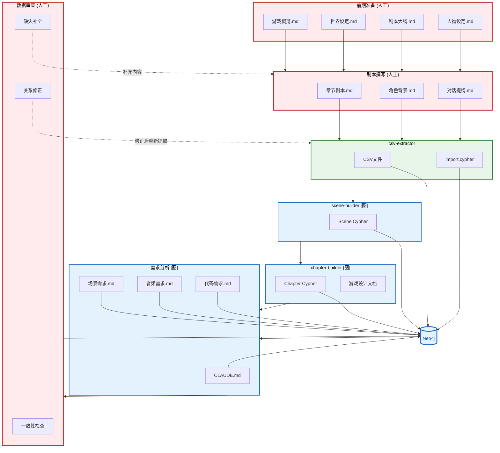
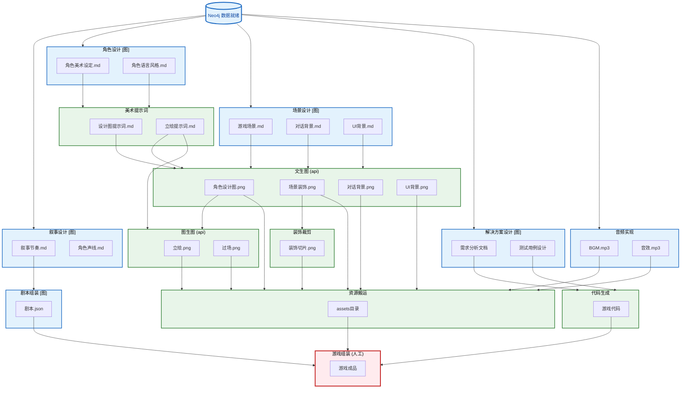
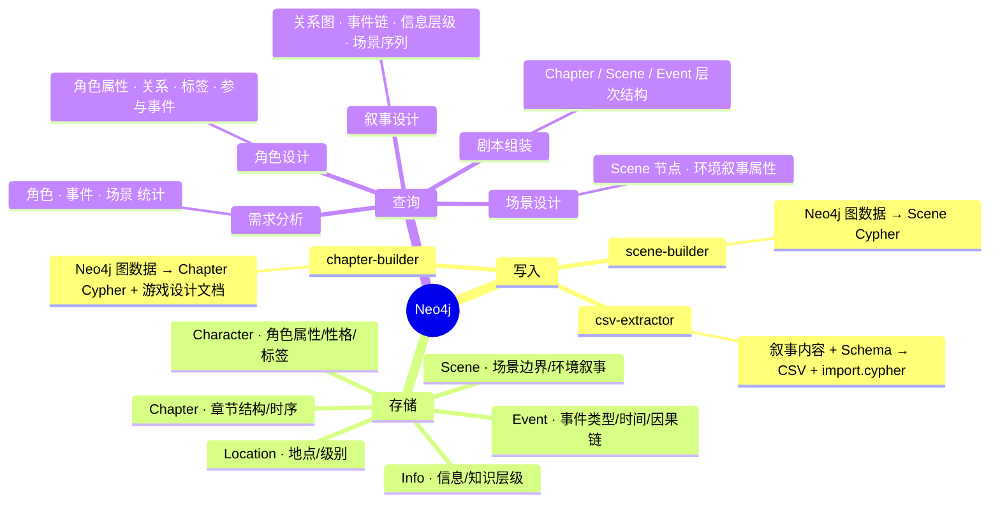

# 万物为铜 - 游戏开发流程图

---

## 1. 叙事数据打磨流程 (剧本 → 图数据库)

> 反复迭代：撰写剧本 → 提取结构化数据 → 导入图数据库 → 审查 → 补充/修改 → 再次提取。

## 2. 游戏开发流程 (图数据已就绪)

> 前提：Neo4j 中已有完整的叙事数据（角色、事件、场景、章节等），开发流程从此开始。

### Neo4j 数据中枢 (mindmap)

> 下方独立展示 Neo4j 作为结构化数据中枢的角色：哪些 Skill 向图写入，哪些从图读取。

---

## 图例说明

| 样式 | 含义 |
|------|------|
| 蓝色节点 + [图] 标记 | 从 Neo4j 读取结构化数据的 Skill |
| 绿色节点 | Skill 自动完成 |
| 红色节点 | 人工完成 |
| 虚线箭头 | 迭代回溯（审查后返回修改） |

---

## 数据流说明

### 图数据库存储内容

Neo4j 作为结构化数据中枢，存储以下实体及其关系：

| 节点类型 | 存储内容 | 示例 |
|---------|---------|------|
| Character | 角色属性、性格标签、外貌特征 | char_001 陆择：{性别:男, 标签:[穿越者,冷静]} |
| Location | 地点属性、级别 | loc_001 陈默公寓：{级别:私密} |
| Event | 事件类型、时间、描述 | evt_001 首次穿越：{类型:转折} |
| Info | 信息节点、知识层级 | info_001 穿越规则：{知识层:1} |
| Scene | 场景边界、环境叙事属性 | scene_001 陈默公寓·夜 |
| Chapter | 章节结构、时序关系 | chapter_001 开场 |

> Schema 定义见 `00_init/Schema.md`

### 各 Skill 与图数据库的交互

| Skill | 从图读取 | 产出 |
|-------|---------|------|
| narrative-csv-extractor | — | CSV 文件 + import.cypher → 导入 Neo4j |
| narrative-scene-builder | 已有节点/边 | Scene 节点 Cypher → 导入 Neo4j |
| narrative-chapter-builder | Scene + 实体 | Chapter 节点 + 游戏设计文档 |
| 需求分析 | 角色/事件/场景统计 | CLAUDE.md, 场景需求.md, 音频需求.md, 代码需求.md |
| 叙事设计 | 角色关系图、事件因果链、信息层级、场景序列 | 叙事节奏文档、角色声线支柱 |
| 角色设计 | 角色属性(外貌/性格/标签)、关系、参与事件 | 角色美术设定.md、角色语言风格.md |
| 场景设计 | Scene 节点环境叙事属性 | 游戏场景.md、对话背景.md、UI背景.md |
| 剧本组装 | Chapter/Scene/Event 层次结构 | 剧本.json |

---

## Skill 说明

| Skill | 类型 | 说明 |
|-------|------|------|
| **narrative-csv-extractor** | 已有 | 从叙事内容提取实体/关系，输出 CSV 文件和 import.cypher 批量导入脚本 |
| **narrative-scene-builder** | 已有 | 在已有图数据上通过5维度识别场景边界，创建 Scene 节点 |
| **narrative-chapter-builder** | 已有 | 组织场景为章节，建立时序/并行关系，生成游戏设计文档 |
| **neo4j-nl-interface** | 已有 | 自然语言 ↔ Cypher 双向接口，底层基础设施 |
| **叙事设计** | 新增 | 查询图中关系/节奏/信息层级，设计叙事节奏、对话架构、角色声线支柱 |
| **图数据管理** | 新增 | 图数据一致性检查、数据补全、导出报告 |
| **需求分析** | 改进 | 增加从 Neo4j 查询角色/事件/场景的结构化统计 |
| **角色设计** | 改进 | 增加从 Neo4j 查询角色属性（外貌/性格/标签）和关系数据 |
| **场景设计** | 改进 | 增加从 Neo4j 查询 Scene 节点的环境叙事属性 |
| **剧本组装** | 改进 | 增加从 Neo4j 查询 Chapter/Scene/Event 层次结构 |
| **美术提示词** | 不变 | 根据角色美术设定，生成角色设计图和立绘提示词 |
| **解决方案设计** | 不变 | 基于代码需求进行技术方案分析，输出测试用例 |
| **文生图 (api)** | 不变 | 调用 seedream API 生成角色设计图、场景装饰、对话/UI 背景 |
| **图生图 (api)** | 不变 | 调用 seedream API 基于设计图生成立绘和过场图片 |
| **装饰裁剪 (脚本)** | 不变 | 切割宫格图片为独立装饰图片 |
| **音频实现** | 不变 | 根据音频需求生成 BGM 和音效 |
| **代码生成** | 不变 | 根据需求分析文档生成游戏源代码 |
| **资源搬运** | 不变 | 将终稿资源同步到游戏项目目录 |

---

## 叙事管线内部流程

图数据库构建阶段（STAGE 2）的内部数据流详见 `reference/narrative-pipeline.md`。
