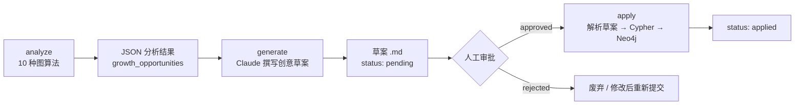
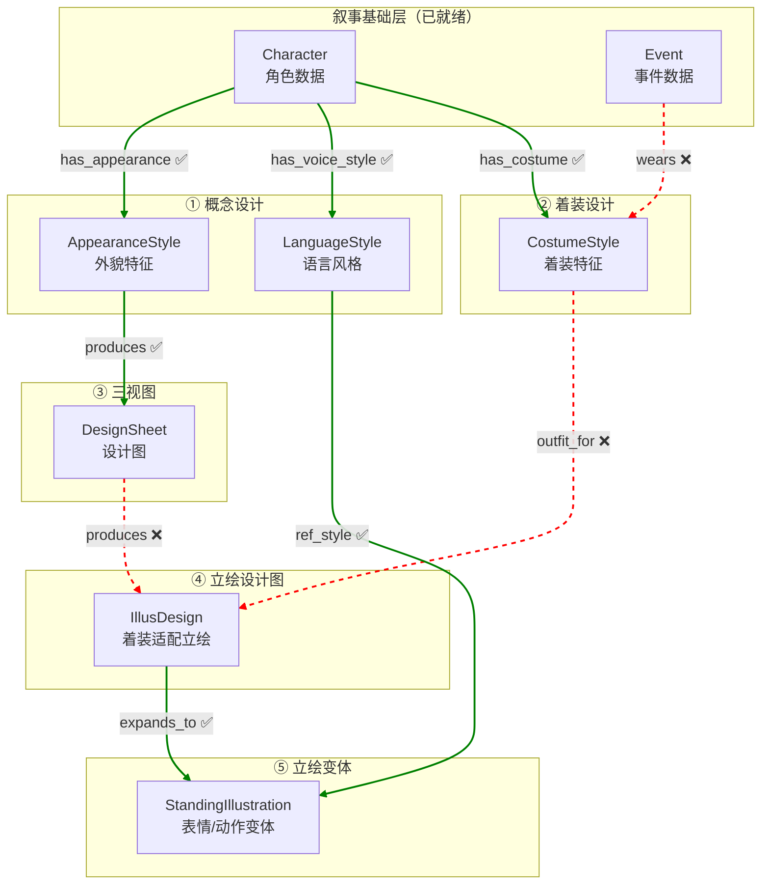

# 他者之镜 - 图数据库节点治理手册

> **本文定位**：从**节点视角**描述 Neo4j 图数据库中每种节点的生命周期——由哪个 Skill 创建、Status 如何流转、是否需要审批、修改后是否级联影响下游。
> 与 [README.md](README.md)（流程视角）互补，作为数据治理查阅手册。

---

## 目录

1. [叙事基础节点的提取与自增长](#1-叙事基础节点的提取与自增长)
2. [角色美术节点的生成流程](#2-角色美术节点的生成流程)
3. [场景美术节点的流程](#3-场景美术节点的流程todo)
4. [剧情的流程](#4-剧情的流程todo)

---

## 1. 叙事基础节点的提取与自增长

> 叙事基础层是整个图数据库的基石，记录"谁做了什么、在哪里、知道了什么"。
> 涵盖 4 种节点（Character / Event / Scene / Info）和 6 种边。

### 1.1 数据流概览


### 1.2 三个 Skill 角色对比

| | **nrt-narrative-extractor** | **nrt-graph-builder** | **nrt-narrative-grower** |
|---|---|---|---|
| **职责** | 从创作文本提取结构化实体与关系 | 手动/自动发现模式增量构建图 | 分析缺口 → 生成创意草案 → 审核后写入 |
| **触发方式** | 用户提供文本 + Schema | 用户说"加角色/事件/关系"或 discover | 用户说"叙事增长/补剧情/分析叙事" |
| **创建的节点** | Character, Event, Scene, Info | Character, Event, Scene, Info + Faction, Location 等 | Scene, Event, Info（通过草案） |
| **创建的边** | 全部 6 种叙事基础边 | 全部叙事边 + BELONGS_TO, CATEGORIZED_AS | relation, involved, occurred_at, evt_relation, link |
| **输出形式** | CSV 文件 + import.cypher（离线文件） | 直接写入 Neo4j | 草案 .md 文件 → 审批 → 写入 Neo4j |
| **连接数据库** | ❌ 不直连 Neo4j | ✅ 直接读写 | ✅ analyze/apply 读写 |
| **幂等性** | MERGE（重复导入不产生重复节点） | MERGE | MERGE |

### 1.3 节点生成详解

#### nrt-narrative-extractor（离线提取）

```
创作文本 + Schema
  → 按节点类型逐类扫描
  → 区分事件层/结论层，判定知识层级 1/2/3
  → 提取 6 种边关系
  → 输出：
      01_叙事数据/实体/*.md        （人类可读的实体描述）
      01_叙事数据/csv/*.csv        （结构化数据）
      01_叙事数据/csv/_import.cypher（导入脚本）
```

产出物经**人工审核**后，通过 `infra-neo4j-helper` 执行 import.cypher 导入 Neo4j。

#### nrt-graph-builder（增量构建）

两种模式：

| 模式 | 说明 | 写入方式 |
|------|------|---------|
| **手动** | 解析自然语言中的实体/关系 | `add-nodes` / `add-edges` 直接写入 Neo4j |
| **发现** | 运行 7 种图算法检查缺口 | 输出建议列表（high/medium/low 优先级），用户确认后手动写入 |

发现的 7 种检查类型：

| 检查类型 | 优先级 | 说明 |
|---------|--------|------|
| missing-relations | high | 角色之间缺少关系 |
| temporal-gaps | high | 时间线上有缺口 |
| orphans | medium | 孤立节点（无任何边） |
| events-no-location | medium | 事件没有关联地点 |
| info-no-links | medium | 信息没有关联到实体 |
| chars-no-faction | low | 角色没有阵营归属 |
| events-unlinked | low | 事件没有因果/时序链接 |

#### nrt-narrative-grower（自增长）

三阶段流程：



10 种分析算法（偏向**叙事创意发现**，与 graph-builder 的数据质量检查互补）：

| # | 算法 | 说明 |
|---|------|------|
| 1 | temporal_gaps | 时间线缺口 |
| 2 | character_arcs | 角色弧完整性（active / vanished / no_events） |
| 3 | implicit_relations | 隐含但未显式记录的关系 |
| 4 | event_chains | 事件链断裂 |
| 5 | scene_utilization | 场景利用率 |
| 6 | info_depth | 信息深度（知识层级分布） |
| 7 | subgraph_connectivity | 子图连通性 |
| 8 | relationship_evolution | 关系演化轨迹 |
| 9 | bridge_scenes | 桥接场景（连接多条故事线） |
| 10 | narrative_density | 叙事密度（事件/时间分布） |

### 1.4 审批流程

> 叙事基础层中，**仅有 nrt-narrative-grower 的草案有显式审批流程**。

```
pending（初始） → approved（人工批准） → applied（自动，导入成功后）
                → rejected（人工驳回）
```

- extractor 产出物经人工审核后由用户手动触发导入，但无正式 status 字段
- graph-builder 手动模式直接写入，无审批；发现模式产出建议后需用户确认
- **叙事基础节点本身没有 approve 字段**，不参与下游审批

### 1.5 级联修改

> 叙事基础层的**所有边 sync=false**，即**不存在自动级联修改**。

修改一个 Character 的属性不会自动影响关联的 Event、Scene 或 Info。这是设计上的选择：叙事数据以"事实记录"为主，修改某个角色描述不应级联重写其参与的事件。

补充机制是通过 graph-builder discover 和 narrative-grower analyze 实现**级联发现**——发现因数据变更而暴露的新缺口，但只产出建议，不自动修改。

---

## 2. 角色美术节点的生成流程

> 角色美术生产链是一个**有向无环图（DAG）**，从叙事基础层的 Character 出发，
> 经过 5 个业务 Skill 的有序协作，最终产出完整的立绘变体图片。

### 2.1 生产链 DAG 概览



> 图例：✅ = sync=true（级联传播），❌ = sync=false（阻断级联）

### 2.2 五个业务 Skill 角色对比

| | **char-concept-designer** | **char-costume-designer** | **char-design-sheet** | **char-illus-designer** | **char-stand-designer** |
|---|---|---|---|---|---|
| **阶段** | ① 概念设计 | ② 着装设计 | ③ 三视图 | ④ 立绘设计图 | ⑤ 立绘变体 |
| **创建的节点** | AppearanceStyle, LanguageStyle | CostumeStyle | DesignSheet | IllusDesign | StandingIllustration |
| **创建的边** | has_appearance, has_voice_style | has_costume, wears | produces | produces, outfit_for | expands_to, ref_style |
| **前驱依赖** | Character 存在 | Character 存在 | AppearanceStyle.status=1 | DesignSheet.status=2 + CostumeStyle.approve=approved | IllusDesign.status=2 |
| **调用子 Skill** | infra-neo4j-helper | infra-neo4j-helper | char-prompt-assembler (Mode A) + infra-image-generator | char-prompt-assembler (Mode B) + infra-image-generator | char-prompt-assembler (Mode C) + infra-image-generator |
| **参数** | char_id | char_id | node_id, target_status | char_id, target_status | char_id, target_status |

### 2.3 两类 Status 流转

#### 数据节点（AppearanceStyle, LanguageStyle）

```
0（待设计） ──[char-concept-designer 填写内容]──→ 1（已完成）
```

#### 生产节点（DesignSheet, IllusDesign, StandingIllustration）

```
0（待生成） ──[char-prompt-assembler 写入 prompt]──→ 1（提示词完成）
                                                 ──[infra-image-generator 生成图片]──→ 2（图片生成完成）
```

#### CostumeStyle（特殊数据节点）

创建即 `status=1`（内容在创建时直接填写），但同时设 `approve='pending'`。

#### 全节点 Status 汇总表

| 节点 | 生成 Skill | 0 | 1 | 2 | approve |
|------|-----------|---|---|---|---------|
| AppearanceStyle | char-concept-designer | 待设计 | 已完成 | — | ❌ 无 |
| LanguageStyle | char-concept-designer | 待设计 | 已完成 | — | ❌ 无 |
| CostumeStyle | char-costume-designer | — | 创建即为 1 | — | ✅ 创建时 pending |
| DesignSheet | char-design-sheet | 待生成 | 提示词完成 | 图片完成 | ✅ 创建时 pending |
| IllusDesign | char-illus-designer | 待生成 | 提示词完成 | 图片完成 | ✅ 创建时 pending |
| StandingIllustration | char-stand-designer | 待生成 | 提示词完成 | 图片完成 | ✅ 创建时 pending |

### 2.4 审批流程

> 4 种节点需要审批，均在**创建时**即设 `approve='pending'`，等待 Dashboard 审批。

```
null（未完成/不适用）
  → pending（已完成，等待审批）
    → approved（审批通过，允许下游推进）
    → rejected（驳回，status 回退为 0，需重新处理）
```

**审批与下游推进的关系**：

| 被审批节点 | 下游消费者 | 审批状态要求 |
|-----------|-----------|------------|
| CostumeStyle | IllusDesign（outfit_for 边） | approve=approved 才允许 IllusDesign 推进 |
| DesignSheet | IllusDesign（produces 边） | approve=approved 才允许 IllusDesign 推进 |
| IllusDesign | StandingIllustration（expands_to 边） | approve=approved 才允许 Standing 推进 |
| StandingIllustration | 无下游 | 创建时即 pending，审批仅作为质量确认 |

**AppearanceStyle 和 LanguageStyle 无审批流程**——它们是设计方向的文字描述，不产出图片，直接由设计师确认。

### 2.5 Sync 级联机制

> 这是角色美术生产链的**核心设计机制**。每条边有一个 `sync` 布尔属性，
> 决定上游节点修改后是否级联重置下游节点。

#### 级联规则

当某节点数据发生变更时：
1. 沿 `sync=true` 的出边做 **BFS（广度优先搜索）**
2. 将所有可达下游节点的 `status` 重置为 `0`，`approve` 清除为 `null`
3. 遇到 `sync=false` 的边时**阻断传播**

#### sync=true 的边（级联传播）

| 边 | 方向 | 级联效果 |
|----|------|---------|
| has_appearance | Character → AppearanceStyle | 角色基础数据变更 → 重置外貌设计 |
| has_voice_style | Character → LanguageStyle | 角色基础数据变更 → 重置语言风格 |
| has_costume | Character → CostumeStyle | 角色基础数据变更 → 重置着装设计 |
| produces | AppearanceStyle → DesignSheet | 外貌变更 → 重置设计图 |
| expands_to | IllusDesign → StandingIllustration | 立绘设计变更 → 重置所有变体 |
| ref_style | LanguageStyle → StandingIllustration | 语言风格变更 → 重置引用它的变体 |

#### sync=false 的边（阻断级联）

| 边 | 方向 | 阻断原因 |
|----|------|---------|
| produces | DesignSheet → IllusDesign | 设计图更新不自动重着装（着装可独立存在） |
| outfit_for | CostumeStyle → IllusDesign | 着装变更不自动重绘立绘（需人工决定） |
| wears | Event → CostumeStyle | 事件变更不影响着装定义 |

#### 级联场景举例

**场景 A：修改角色外貌描述（AppearanceStyle）**
```
AppearanceStyle 变更
  → sync=true → DesignSheet 重置 (status=0) ✅
  → DesignSheet → IllusDesign (sync=false) → 阻断 ❌
  → IllusDesign 和 StandingIllustration 不受影响
```
**含义**：改了外貌需要重新生成三视图，但已有的着装立绘和变体不自动重做。

**场景 B：修改语言风格（LanguageStyle）**
```
LanguageStyle 变更
  → sync=true → StandingIllustration 全部重置 ✅
```
**含义**：语言风格变更意味着角色气质改变，所有表情/动作变体需要重新生成。

**场景 C：修改着装（CostumeStyle）**
```
CostumeStyle 变更
  → outfit_for (sync=false) → 阻断 ❌
  → IllusDesign 不受影响
```
**含义**：着装修改不会自动重绘对应立绘，需人工决定是否重做。

### 2.6 提示词分层策略

> 三层提示词采用**增量策略**，每层只描述上一层没有覆盖的内容，配合图生图的参考图机制实现分层精细控制。

| 层级 | 节点 | 提示词聚焦 | 图片生成方式 | 参考图 |
|------|------|-----------|------------|--------|
| 底层 | DesignSheet | **外貌**（脸、体型、发色、五官）。角色统一穿深色基础衣物，不描述衣着 | 文生图 | 无 |
| 中层 | IllusDesign | **着装**（衣物、材质、配饰）。不重复外貌（已在底图中） | 图生图 | DesignSheet.image_path |
| 顶层 | StandingIllustration | **表情+动作**（面部表情、手部、脚部）。不重复外貌和着装 | 图生图 | IllusDesign.image_path |

提示词由 `char-prompt-assembler` 统一组装（三种模式 A/B/C），通过 `infra-image-generator` 调用 OfoxAI API 生成图片。

### 2.7 编排层

> `char-design` Agent 作为纯编排层，不直接创建或修改任何节点。
> 只负责查询图状态、决定下一步调度哪个 Skill、处理 sync 级联。

用户可通过 `char-design` 传入角色名或 ID，Agent 自动查询当前进度并调度对应 Skill 推进。也可无参数调用查看所有角色的美术进度概览。

---

## 3. 场景美术节点的流程（TODO）

> **当前状态**：Schema 框架已建立（[场景美术.md](00_init/Schema/场景美术.md)），但无独立节点。
> Scene 节点定义在叙事基础层（[叙事基础.md](00_init/Schema/叙事基础.md)），场景美术层仅引用。

### 待补充内容

- 场景美术独立节点定义（如 SceneDesign, SceneAsset 等）
- 场景美术 Skill（查询 Scene → 生成游戏场景/对话背景/UI背景的提示词 → 调用文生图 API）
- Status 流转与审批流程
- 与叙事基础层 Scene 节点的 sync 级联关系
- 场景装饰裁剪流程

---

## 4. 剧情的流程（TODO）

> **当前状态**：Schema 标注"待补充"（[剧情.md](00_init/Schema/剧情.md)）。

### 待补充内容

- 剧情相关节点定义（如 Chapter, Branch, Condition, Dialogue 等）
- 剧情生成/组装 Skill
- 从叙事基础层（Event, Character, Info）到剧情节点的转换流程
- 分支/条件逻辑的表示方式
- Status 流转与审批流程
- 与叙事基础层的 sync 级联关系

---

## 附录：基础设施 Skill

以下两个 Skill 作为基础设施层，被所有业务 Skill 调用，不直接创建业务节点。

| Skill | 职责 | 说明 |
|-------|------|------|
| **infra-neo4j-helper** | 自然语言 + Schema → Cypher → 执行 → 结构化返回 | 所有 Skill 读写图数据库的统一入口。支持多语句、增删改查混杂。 |
| **infra-image-generator** | 从图节点读取 prompt 调用 OfoxAI API 生成图片 | 支持文生图（DesignSheet）和图生图（IllusDesign, StandingIllustration）。生成后设 approve='pending'。 |

另有 `char-prompt-assembler` 作为提示词组装层，被 char-design-sheet / char-illus-designer / char-stand-designer 调用，不主动创建节点，只写入 prompt 字段并推进 status。
