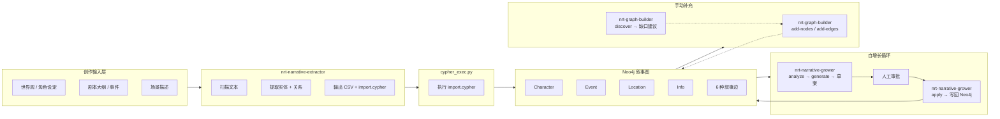
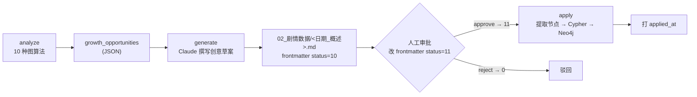
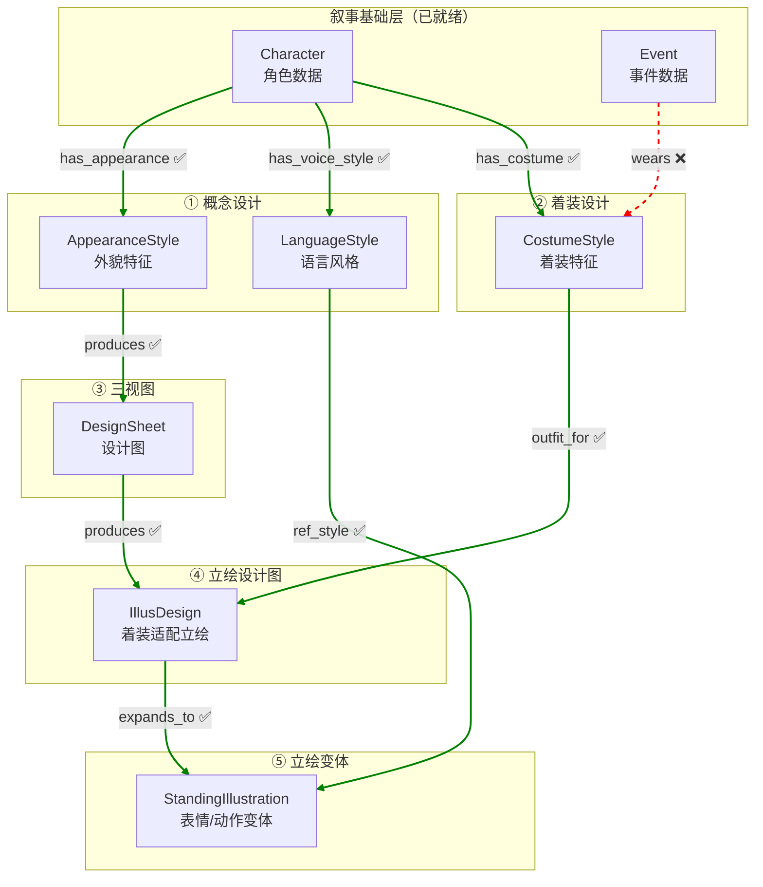

# 他者之镜 - 图数据库节点治理手册

> **本文定位**：从**节点视角**描述 Neo4j 图数据库中每种节点的生命周期——由哪个 Skill 创建、Status 如何流转、是否需要审批、修改后是否级联影响下游。
> 与 [README.md](README.md)（流程视角）互补，作为数据治理查阅手册。

---

## 目录

1. [叙事基础节点的提取与自增长](#1-叙事基础节点的提取与自增长)
2. [角色美术节点的生成流程](#2-角色美术节点的生成流程)
3. [场景美术节点的流程](#3-场景美术节点的流程todo)
4. [剧情的流程](#4-剧情的流程todo)

---

## 1. 叙事基础节点的提取与自增长

> 叙事基础层是整个图数据库的基石，记录"谁做了什么、在哪里、知道了什么"。
> 涵盖 4 种节点（Character / Event / Location / Info）和 6 种边。

### 1.1 数据流概览



### 1.2 三个 Skill 角色对比

| | **nrt-narrative-extractor** | **nrt-graph-builder** | **nrt-narrative-grower** |
|---|---|---|---|
| **职责** | 从创作文本提取结构化实体与关系 | 手动/自动发现模式增量构建图 | 分析缺口 → 生成创意草案 → 审核后写入 |
| **触发方式** | 用户提供文本 + Schema | 用户说"加角色/事件/关系"或 discover | 用户说"叙事增长/补剧情/分析叙事" |
| **创建的节点** | Character, Event, Location, Info | Character, Event, Location, Info + Faction, Location 等 | Location, Event, Info（通过草案） |
| **创建的边** | 全部 6 种叙事基础边 | 全部叙事边 + BELONGS_TO, CATEGORIZED_AS | relation, involved, occurred_at, evt_relation, link |
| **输出形式** | CSV 文件 + import.cypher（离线文件） | 直接写入 Neo4j | Markdown 文件（02_剧情数据/，frontmatter status=10）→ 人工审批 → apply 写入 Neo4j |
| **连接数据库** | ❌ 不直连 Neo4j | ✅ 直接读写 | ✅ analyze/apply 读写 |
| **幂等性** | MERGE（重复导入不产生重复节点） | MERGE | MERGE |

### 1.3 节点生成详解

#### nrt-narrative-extractor（离线提取）

```
创作文本 + Schema
  → 按节点类型逐类扫描
  → 区分事件层/结论层，判定知识层级 1/2/3
  → 提取 6 种边关系
  → 输出：
      01_叙事数据/实体/*.md        （人类可读的实体描述）
      01_叙事数据/csv/*.csv        （结构化数据）
      01_叙事数据/csv/_import.cypher（导入脚本）
```

产出物经**人工审核**后，通过 `${CLAUDE_SKILL_DIR}/../../scripts/cypher_exec.py` 执行 import.cypher 导入 Neo4j。

#### nrt-graph-builder（增量构建）

两种模式：

| 模式 | 说明 | 写入方式 |
|------|------|---------|
| **手动** | 解析自然语言中的实体/关系 | `add-nodes` / `add-edges` 直接写入 Neo4j |
| **发现** | 运行 7 种图算法检查缺口 | 输出建议列表（high/medium/low 优先级），用户确认后手动写入 |

发现的 7 种检查类型：

| 检查类型 | 优先级 | 说明 |
|---------|--------|------|
| missing-relations | high | 角色之间缺少关系 |
| temporal-gaps | high | 时间线上有缺口 |
| orphans | medium | 孤立节点（无任何边） |
| events-no-location | medium | 事件没有关联地点 |
| info-no-links | medium | 信息没有关联到实体 |
| chars-no-faction | low | 角色没有阵营归属 |
| events-unlinked | low | 事件没有因果/时序链接 |

#### nrt-narrative-grower（自增长）

三阶段流程：



10 种分析算法（偏向**叙事创意发现**，与 graph-builder 的数据质量检查互补）：

| # | 算法 | 说明 |
|---|------|------|
| 1 | temporal_gaps | 时间线缺口 |
| 2 | character_arcs | 角色弧完整性（active / vanished / no_events） |
| 3 | implicit_relations | 隐含但未显式记录的关系 |
| 4 | event_chains | 事件链断裂 |
| 5 | scene_utilization | 场景利用率 |
| 6 | info_depth | 信息深度（知识层级分布） |
| 7 | subgraph_connectivity | 子图连通性 |
| 8 | relationship_evolution | 关系演化轨迹 |
| 9 | bridge_scenes | 桥接场景（连接多条故事线） |
| 10 | narrative_density | 叙事密度（事件/时间分布） |

### 1.4 审批流程

> 叙事基础层中，**仅有 nrt-narrative-grower 的草案有显式审批流程**。草案以 Markdown 文件存于 `02_剧情数据/`，**流程状态记在文件 frontmatter**（不写入图数据库），审批为**手动编辑 frontmatter 的 `status` 字段**。

```
status=10（待审） → status=11（手动改 frontmatter 通过） → applied_at 标记（apply 写回后）
                 → status=0（手动驳回）
```

- 草案为 `02_剧情数据/<日期_概述>.md` 文件（见 [剧情.md](00_init/Schema/剧情.md)），generate 落盘即 frontmatter `status=10`。
- **applied 用独立字段 `applied_at` 表达**（非空=已应用），不占 status 值。
- extractor 产出物经人工审核后由用户手动触发导入，但无正式 status 字段
- graph-builder 手动模式直接写入，无审批；发现模式产出建议后需用户确认
- **叙事基础节点本身没有 approve 字段**，不参与下游审批

### 1.5 级联修改

> 叙事基础层的**所有边 sync=false**，即**不存在自动级联修改**。

修改一个 Character 的属性不会自动影响关联的 Event、Location 或 Info。这是设计上的选择：叙事数据以"事实记录"为主，修改某个角色描述不应级联重写其参与的事件。

补充机制是通过 graph-builder discover 和 narrative-grower analyze 实现**级联发现**——发现因数据变更而暴露的新缺口，但只产出建议，不自动修改。

---

## 2. 角色美术节点的生成流程

> 角色美术生产链是一个**有向无环图（DAG）**，从叙事基础层的 Character 出发，
> 经过 5 个业务 Skill 的有序协作，最终产出完整的立绘变体图片。

### 2.1 生产链 DAG 概览



> 图例：✅ = sync=true（级联传播），❌ = sync=false（阻断级联）

### 2.2 五个业务 Skill 角色对比

| | **char-concept-designer** | **char-costume-designer** | **char-design-sheet** | **char-illus-designer** | **char-stand-designer** |
|---|---|---|---|---|---|
| **阶段** | ① 概念设计 | ② 着装设计 | ③ 三视图 | ④ 立绘设计图 | ⑤ 立绘变体 |
| **创建的节点** | AppearanceStyle, LanguageStyle | CostumeStyle | DesignSheet | IllusDesign | StandingIllustration |
| **创建的边** | has_appearance, has_voice_style | has_costume, wears | produces | produces, outfit_for | expands_to, ref_style |
| **前驱依赖** | Character 存在 | Character 存在 | AppearanceStyle.status=1 | DesignSheet.status=2 + CostumeStyle.status=11 | IllusDesign.status=2 |
| **调用子 Skill** | — | — | char-prompt-assembler (Mode A) + infra-image-generator | char-prompt-assembler (Mode B) + infra-image-generator | char-prompt-assembler (Mode C) + infra-image-generator |

> 所有 skill 通过 `${CLAUDE_SKILL_DIR}/../../scripts/cypher_exec.py` 读写图数据库。每个 skill 内部遵循三段式【查状态 → 完成任务 → 保存结果】：char-prompt-assembler / infra-image-generator 为**纯产出层**（只产文件、不写图），节点字段与 status 由生产 skill 在「保存结果」步用 MERGE 兜底统一写入。
| **参数** | char_id | char_id | node_id, target_status | char_id, target_status | char_id, target_status |

### 2.3 两类 Status 流转

#### 数据节点（AppearanceStyle, LanguageStyle）

```
0（待设计） ──[char-concept-designer 填写内容]──→ 1（已完成）
```

#### 生产节点（DesignSheet, IllusDesign, StandingIllustration）

```
0（待生成） ──[char-prompt-assembler 写入 prompt]──→ 1（提示词完成）
                                                 ──[infra-image-generator 生成图片]──→ 2（图片生成完成）
```

#### CostumeStyle（数据节点）

创建即 `status=1`（内容在创建时直接填写，已完成，无审批）。

#### 全节点 Status 汇总表

> 审批态与生产态隔开：生产 `0/1/2`（`0`=首次待生成），审批专属 `10`（待审）/ `11`（批准）。通过 → `11`；驳回 → `0`。另：**`-1` = 作废重做**（sync 级联重置后；skill 看到 `-1` 必须重新生成并覆盖旧产物，禁止因文件已存在而跳过）。

| 节点 | 生成 Skill | 0 | 1 | 2 | 10 | 11 |
|------|-----------|---|---|---|----|----|
| AppearanceStyle | char-concept-designer | 待设计 | 已完成 | — | — | — |
| LanguageStyle | char-concept-designer | 待设计 | 已完成 | — | — | — |
| CostumeStyle | char-costume-designer | 待设计 | 已完成 | — | — | — |
| DesignSheet | char-design-sheet | 待生成 | 提示词完成 | 图片完成 | 待审 | 批准 |
| IllusDesign | char-illus-designer | 待生成 | 提示词完成 | 图片完成 | 待审 | 批准 |
| StandingIllustration | char-stand-designer | 待生成 | 提示词完成 | 图片完成 | 待审 | 批准 |

### 2.4 审批流程

> 3 种节点需要审批。审批态用 `10`（待审）/ `11`（批准），与生产态 `0/1/2` 隔开。

```
未完成（status < 完成值）
  → 待审（status = 10，图片/着装已完成）
    → 通过（status = 11，允许下游推进）
    → 驳回（status 回退为 0，需重新处理）
```

**审批与下游推进的关系**：

| 被审批节点 | 下游消费者 | 推进条件 |
|-----------|-----------|---------|
| DesignSheet | IllusDesign（produces 边） | status=11（批准）才允许 IllusDesign 推进 |
| IllusDesign | StandingIllustration（expands_to 边） | status=11（批准）才允许 Standing 推进 |
| StandingIllustration | 无下游 | status=10（待审）仅作为质量确认 |

**AppearanceStyle、LanguageStyle 和 CostumeStyle 无审批流程**——它们是设计方向的文字描述，不产出图片，直接由设计师确认。

### 2.5 Sync 级联机制

> 这是角色美术生产链的**核心设计机制**。每条边有一个 `sync` 布尔属性，
> 决定上游节点修改后是否级联重置下游节点。

#### 级联规则

当某节点数据发生变更时：
1. 沿 `sync=true` 的出边做 **BFS（广度优先搜索）**
2. 将所有可达下游节点的 `status` 重置为 `0`
3. 遇到 `sync=false` 的边时**阻断传播**

#### sync=true 的边（级联传播）

| 边 | 方向 | 级联效果 |
|----|------|---------|
| has_appearance | Character → AppearanceStyle | 角色基础数据变更 → 重置外貌设计 |
| has_voice_style | Character → LanguageStyle | 角色基础数据变更 → 重置语言风格 |
| has_costume | Character → CostumeStyle | 角色基础数据变更 → 重置着装设计 |
| produces | AppearanceStyle → DesignSheet | 外貌变更 → 重置设计图 |
| produces | DesignSheet → IllusDesign | 设计图变更 → 重置立绘设计图 |
| outfit_for | CostumeStyle → IllusDesign | 着装变更 → 重置立绘设计图 |
| expands_to | IllusDesign → StandingIllustration | 立绘设计变更 → 重置所有变体 |
| ref_style | LanguageStyle → StandingIllustration | 语言风格变更 → 重置引用它的变体 |

#### sync=false 的边（阻断级联）

| 边 | 方向 | 阻断原因 |
|----|------|---------|
| wears | Event → CostumeStyle | 事件变更不影响着装定义 |

#### 级联场景举例

**场景 A：修改角色外貌描述（AppearanceStyle）**
```
AppearanceStyle 变更
  → sync=true → DesignSheet 重置 ✅
  → sync=true → IllusDesign 重置 ✅（produces）
  → sync=true → StandingIllustration 重置 ✅（expands_to）
```
**含义**：外貌是整条美术链的基础，改外貌全链重置（设计图→立绘设计图→立绘变体都需重做）。

**场景 B：修改语言风格（LanguageStyle）**
```
LanguageStyle 变更
  → sync=true → StandingIllustration 全部重置 ✅
```
**含义**：语言风格变更意味着角色气质改变，所有表情/动作变体需要重新生成。

**场景 C：修改着装（CostumeStyle）**
```
CostumeStyle 变更
  → outfit_for (sync=true) → IllusDesign 重置 ✅
  → sync=true → StandingIllustration 重置 ✅（expands_to）
```
**含义**：着装变更会重置穿该着装的所有立绘设计图及其变体。

### 2.6 提示词分层策略

> 三层提示词采用**增量策略**，每层只描述上一层没有覆盖的内容，配合图生图的参考图机制实现分层精细控制。

| 层级 | 节点 | 提示词聚焦 | 图片生成方式 | 参考图 |
|------|------|-----------|------------|--------|
| 底层 | DesignSheet | **外貌**（脸、体型、发色、五官）。角色统一穿深色基础衣物，不描述衣着 | 文生图 | 无 |
| 中层 | IllusDesign | **着装**（衣物、材质、配饰）。不重复外貌（已在底图中） | 图生图 | DesignSheet.image_path |
| 顶层 | StandingIllustration | **表情+动作**（面部表情、手部、脚部）。不重复外貌和着装 | 图生图 | IllusDesign.image_path |

提示词由 `char-prompt-assembler` 统一组装（三种模式 A/B/C），通过 `infra-image-generator` 调用 OfoxAI API 生成图片。

### 2.7 编排层

> `char-design` Agent 作为纯编排层，不直接创建或修改任何节点。
> 只负责查询图状态、决定下一步调度哪个 Skill、处理 sync 级联。

用户可通过 `char-design` 传入角色名或 ID，Agent 自动查询当前进度并调度对应 Skill 推进。也可无参数调用查看所有角色的美术进度概览。

### 2.8 立绘按需生成（TODO）

> 当前 `char-stand-designer` 按角色优先级一次生成所有变体。**按需生成（入度>N 才出图）待实现**。

计划：先建变体节点+提示词（status=1），待立绘被剧情场景引用（入度>N）后再触发出图（status=10）。需要剧情侧定义**场景→立绘引用边**与入度查询，详见 [剧情.md](00_init/Schema/剧情.md) TODO。当前可显式传 `target_status=1` 先批量建节点+提示词而不出图。

---

## 3. 场景美术节点的流程（TODO）

> **当前状态**：Schema 框架已建立（[场景美术.md](00_init/Schema/场景美术.md)），但无独立节点。
> Location 节点定义在叙事基础层（[叙事基础.md](00_init/Schema/叙事基础.md)），场景美术层仅引用。

### 待补充内容

- 场景美术独立节点定义（如 LocationDesign, LocationAsset 等）
- 场景美术 Skill（查询 Location → 生成游戏场景/对话背景/UI背景的提示词 → 调用文生图 API）
- Status 流转与审批流程
- 与叙事基础层 Location 节点的 sync 级联关系
- 场景装饰裁剪流程

---

## 4. 剧情的流程

> **当前状态**：叙事自增长闭环已实现（[剧情.md](00_init/Schema/剧情.md) 定义叙事草案 Markdown 文件规范）。
> `nrt-narrative-grower` 分析叙事图缺口 → 生成创意草案（MD 文件）→ 人工审批 → apply 写回叙事基础层。

### 叙事草案（Markdown 文件）

承载 grower 的 analyze→generate→apply 闭环，文件规范见 [剧情.md](00_init/Schema/剧情.md)。草案存于 `02_剧情数据/<日期_概述>.md`，**不写入图数据库**。

- **status 语义**（frontmatter）：`10` 待审 / `11` 批准 / `0` 驳回 / `-1` 作废。
- **applied**：用独立字段 `applied_at` 表达（非空=已应用），**不占 status 值**。

### 三阶段流程

1. **analyze**（图算法）：跑 10 种叙事创意检查 → `growth_opportunities`。
2. **generate**：Claude 撰写创意草案 → 写 `02_剧情数据/<日期_概述>.md`（frontmatter status=10）。
3. **apply**（status=11 后）：从草案正文提取基础节点（Character/Event/Location/Info + 边）写回叙事基础层 + 回写 frontmatter applied_at。提取规则复用 nrt-narrative-extractor。

### 审批

手动编辑 `02_剧情数据/<日期_概述>.md` 的 frontmatter：`status` 由 `10` 改 `11`（通过）或 `0`（驳回）。apply 由 grower skill 在 Claude Code 侧执行。

### 边

草案本身不是图节点，**不建任何边**。apply 后产生的基础节点之间用叙事基础层 6 种边自连，溯源用 frontmatter `applied_node_ids` 字段。

### TODO

- 立绘按需生成：场景 → 立绘引用边与入度门控，待定义（见 [剧情.md](00_init/Schema/剧情.md) TODO 与 §2.8）。
- 分支/条件剧情（Chapter / Branch / Dialogue 等）尚未定义。

---

## 附录：基础设施 Skill

以下组件作为基础设施层，被所有业务 skill 调用。

| 组件 | 职责 | 说明 |
|------|------|------|
| **cypher_exec.py** | 执行 Cypher（统一图读写入口） | `${CLAUDE_SKILL_DIR}/../../scripts/cypher_exec.py`，所有 skill 读写图数据库的唯一脚本。支持 `-c`/`-f`/`--stdin`/`--multi`/`--json`/`--raw`。Cypher 由调用方即时生成。 |
| **infra-image-generator** | 读 prompt 文件调 OfoxAI API 生成图片（纯产出） | 文生图（DesignSheet）/ 图生图（IllusDesign, StandingIllustration）。不写图、不写 status。 |
| **char-prompt-assembler** | 组装提示词为 prompt 文件（纯产出） | 三种模式 A/B/C。不读写图、不写 status。 |

> infra-neo4j-helper skill 已废弃，脚本合并为 `${CLAUDE_SKILL_DIR}/../../scripts/cypher_exec.py`。char-prompt-assembler / infra-image-generator 为**纯产出层**，只产文件、不写图；节点字段与 status 由调用方（生产 skill）在「保存结果」步统一写入。
