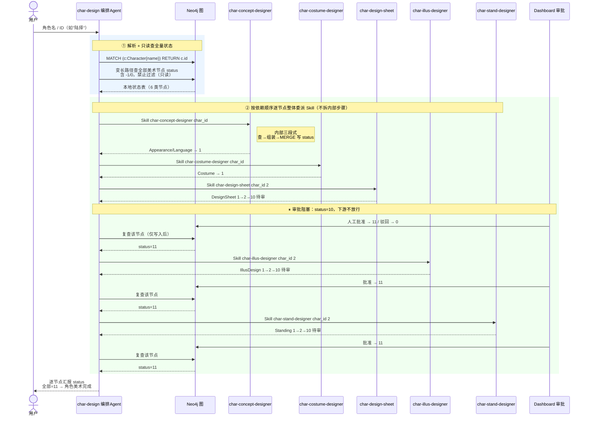
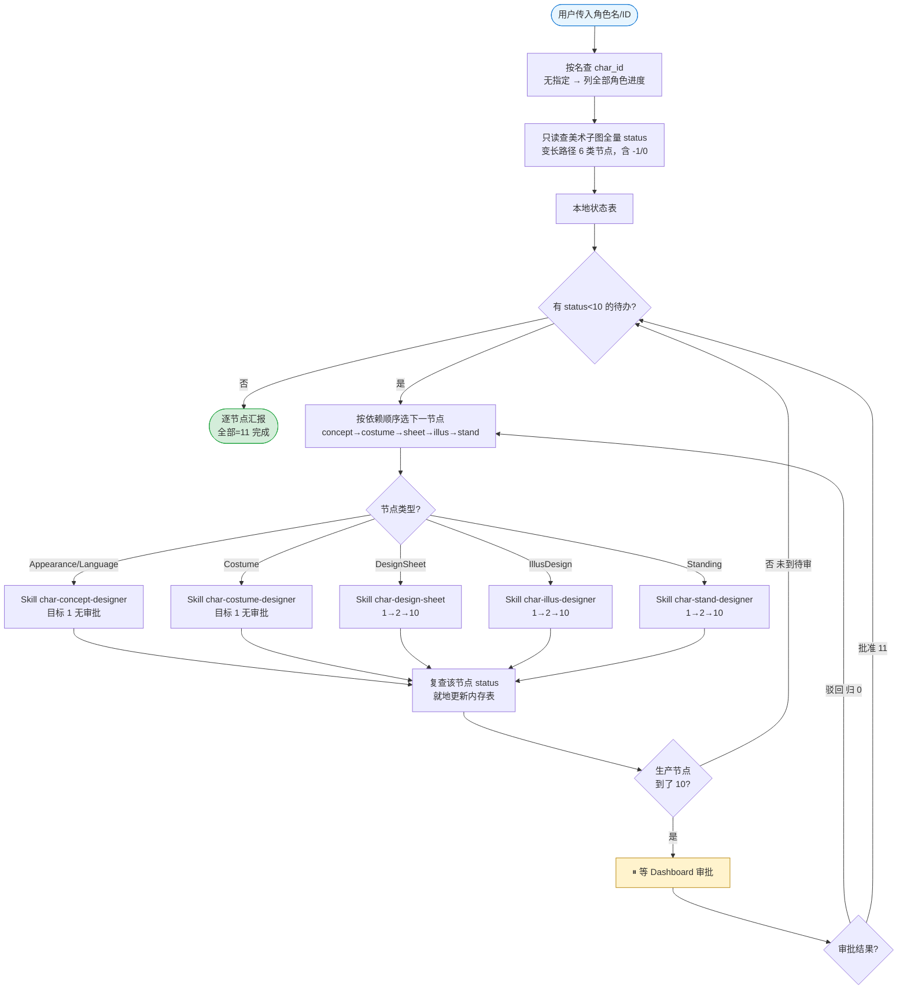
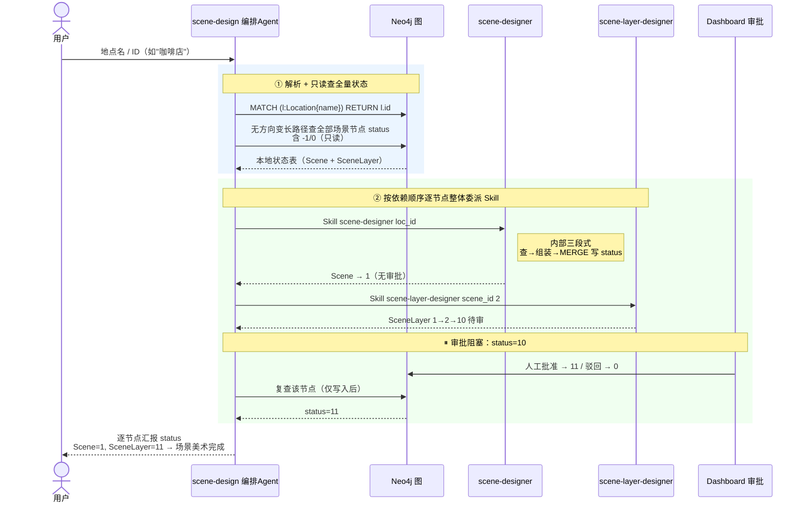
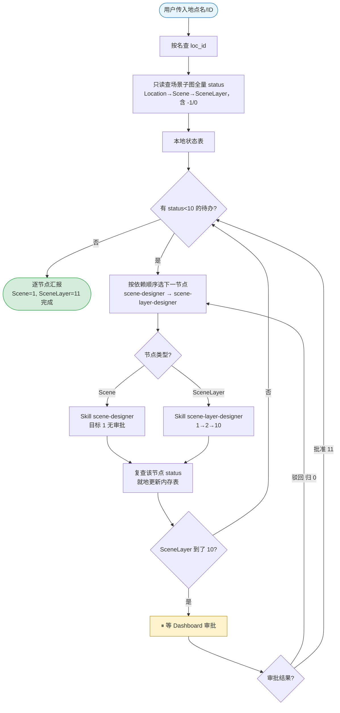
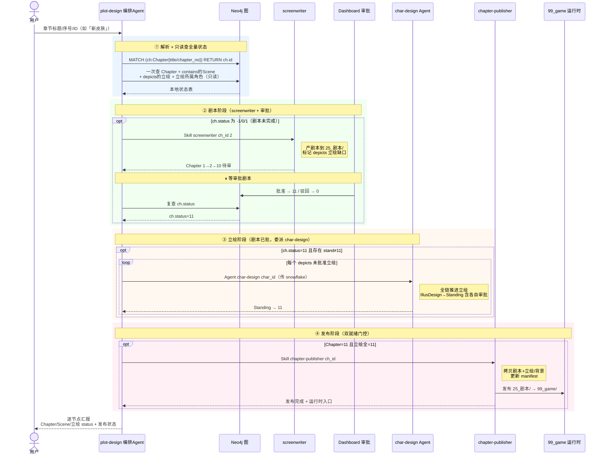
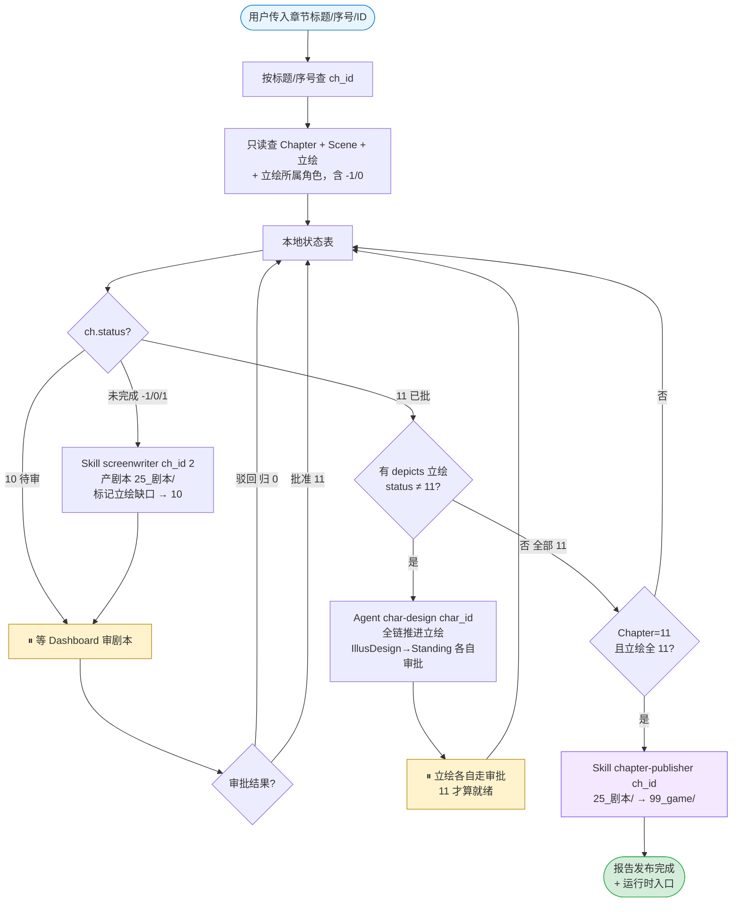

# 他者之镜 - 三大编排 Agent 流程图

> **本文定位**：可视化 [.claude/agents/](.claude/agents/) 下三个**编排层 Agent**（`char-design` / `scene-design` / `plot-design`）的执行流程。
> 每个 Agent 给出 **【时序图】** 与 **【流程图】** 两种表达，二者描述同一流程，**保留其一即可**（时序图侧重"谁在何时调谁"，流程图侧重"状态如何分流"）。
>
> 互补文档：[README.md](README.md)（两阶段流水线全景）、[readme2.md](readme2.md)（节点治理手册）、[refer.md](refer.md)（status / sync 级联 / 审批规则）。

---

## 目录

1. [三个 Agent 的共同铁律](#三个-agent-的共同铁律)
2. [char-design —— 角色美术生产链](#char-design--角色美术生产链)
3. [scene-design —— 场景美术生产链](#scene-design--场景美术生产链)
4. [plot-design —— 剧情创作生产链](#plot-design--剧情创作生产链)

---

## 三个 Agent 的共同铁律

> `char-design` / `scene-design` / `plot-design` 是三条生产链各自的**纯编排层**，骨架完全一致，差异只在"调度哪几个 skill / agent"。

| 铁律 | 含义 |
|------|------|
| **纯分发，不亲自动手** | 只做：解析输入 → 只读查 status → 据 status 决策 → 用 `Skill`/`Agent` 工具整体委派 → 复查 → 汇报。**严禁**亲自写 Cypher、亲自调生成脚本、拆解生产 skill 的内部步骤、直接调纯产出子 skill（`*-prompt-assembler` / `infra-image-generator`）。 |
| **只读查全量，禁止过滤 -1** | 开局一次查询拿到本地状态表。`-1`（作废重做）与 `0`（待生成）都是待办，**禁止**在 WHERE 加 `status >= 0` 把 `-1` 滤掉。 |
| **调度只看 status，不看产物文件** | 唯一判据是节点 `status` 与 `target_status`。**禁止**因 `prompt_path`/`image_path`/`script_path` 已有值或磁盘文件已存在而跳过；`-1` 必须重生成并**覆盖**旧产物，重做时禁止读旧文件。 |
| **全量循环推进，禁止只推一个就停** | 枚举所有 `status < 10` 的待办逐个委派，直到全部到达终态、撞上审批阻塞（`10` 待 dashboard 批）、或撞上需用户决策的分歧点，才返回。 |
| **审批阻塞** | 生产节点图片完成即提交 `10`（待审）；`11`（批准）才允许下游推进；驳回归 `0`。审批由 [55_dashboard](55_dashboard/) 人工触发。 |
| **复查就地在内存表更新** | 仅在 skill/agent 返回（发生一次写入）后，对**该被推进节点**复查一次；禁止每推一个就重查整张子图。 |
| **汇报逐节点交代** | 列出全部节点，逐个给 `status` + 本轮是否处理；未推进的说明原因；**禁止**把 `status=-1` 误报成"节点未创建"。 |

### status 语义（三链通用）

```
-1  作废重做（sync 级联重置后；看到 -1 必须重生成覆盖，禁止跳过）
 0  待处理 / 待生成
 1  已完成（数据节点）｜提示词完成（生产节点）
 2  图片完成（生产节点可选中间态）
10  待审（审批专属，等 dashboard）
11  批准（生产节点唯一"真正完成"值）
```

> 审批态与生产态数值隔开：生产用 `0/1/2`，审批专属 `10`/`11`。数据节点完成值 `1`（无审批）；生产节点完成值 `11`。

---

## char-design —— 角色美术生产链

> **唯一职责**：推进某角色的整条美术链。输入**角色名或 ID**（如"陆择"、snowflake ID）。
> 依赖顺序：`char-concept-designer → char-costume-designer → char-design-sheet → char-illus-designer → char-stand-designer`。

### 节点 → Skill 映射

| 图节点 | Skill | Status 流程 | 审批 |
|--------|-------|------------|------|
| AppearanceStyle / LanguageStyle | char-concept-designer | -1/0 → 1 | 无 |
| CostumeStyle | char-costume-designer | -1/0 → 1 | 无 |
| DesignSheet | char-design-sheet | -1/0→1→2→10→11 | ✅ |
| IllusDesign | char-illus-designer | -1/0→1→2→10→11 | ✅ |
| StandingIllustration | char-stand-designer | -1/0→1→2→10→11 | ✅ |

### 备选 A · 时序图



### 备选 B · 流程图



---

## scene-design —— 场景美术生产链

> **唯一职责**：推进某地点的场景美术。输入**地点名或 ID**（如"咖啡店"、snowflake ID）。
> 依赖顺序：`scene-designer → scene-layer-designer`（Location→Scene→SceneLayer，最深 2 跳）。

### 节点 → Skill 映射

| 图节点 | Skill | Status 流程 | 审批 |
|--------|-------|------------|------|
| Scene | scene-designer | -1/0 → 1 | 无 |
| SceneLayer | scene-layer-designer | -1/0→1→2→10→11 | ✅ |

### 备选 A · 时序图



### 备选 B · 流程图



---

## plot-design —— 剧情创作生产链

> **唯一职责**：推进某章节的剧本与所需立绘，直到发布到运行时。输入**章节标题、序号或 ID**（如「新皮肤」、`1`、snowflake ID）。
> 这是最复杂的一条链——**跨工具委派**（Skill + Agent），且有**两道门控**：剧本先批（`ch.status=11`）才推立绘；立绘全 `11` 才发布。

### 节点 → Skill/Agent 映射

| 图节点 | 委派对象 | 工具 | Status 流程 | 审批 |
|--------|---------|------|------------|------|
| Chapter（剧本） | screenwriter | Skill | -1/0→1→2→10→11 | ✅ |
| StandingIllustration（章节所需立绘） | char-design | Agent | -1/0→1→2→10→11 | ✅ |
| Chapter 发布到运行时 | chapter-publisher | Skill | 仅 Chapter=11 + 立绘全 11 后 | — |

### 调度决策树

- `ch.status` 为 `-1/0/1`（剧本未完成）→ `Skill screenwriter <ch_id> 2`（产剧本到 `25_剧本/` + 标记 depicts 立绘缺口 → `10` 待审）
- `ch.status = 10` → 等 dashboard 审批剧本，不可推进下游
- `ch.status = 11` → 检查 depicts 立绘：对每个 `stand.status ≠ 11` 的角色，用 **Agent** 委派 `char-design`（传 snowflake `char_id`）
- 全部 `stand.status = 11` → `Skill chapter-publisher <ch_id>` 发布 `25_剧本/`→`99_game/`

> **门控理由**：剧本未到 `11` 不推立绘（避免为未定稿剧本浪费出图）；立绘未全 `11` 不发布（避免运行时缺资源）。
> **越界判定**：plot-design 直接调 `char-stand-designer` 就是错的——立绘只能经 `Agent char-design` 整体委派。

### 备选 A · 时序图



### 备选 B · 流程图



---

## 附录：如何挑选时序图 vs 流程图

| 维度 | 时序图（sequenceDiagram） | 流程图（flowchart） |
|------|--------------------------|---------------------|
| **擅长** | 展示"谁在何时调谁"、调用顺序、往返交互 | 展示状态分流、条件分支、循环回路 |
| **读法** | 从上到下按时间线读 | 沿箭头跟状态走 |
| **适合场景** | 向新人解释"编排层与各 skill 的协作关系" | 快速判断"给定某个 status，下一步该干什么" |
| **审批阻塞** | 用 `⏸` + `rect` 高亮阶段块直观 | 用黄色 `Wait` 节点 + 判断分支直观 |

> 两者信息等价。确定保留哪种后，可删除另一组（每个 Agent 的「备选 A」或「备选 B」整节）。
